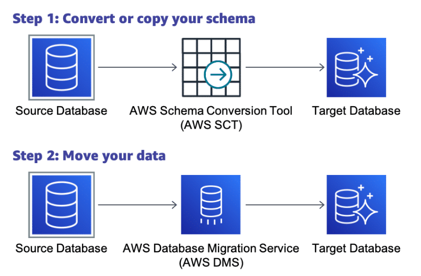

# Introduction to Building with AWS Databases

## SQL DB

### RDS
- makes it easy to set up, operate, and scale a relational database in the cloud. It provides cost-efficient and resizable capacity while automating time-consuming administration tasks, such as hardware provisioning, database setup, patching, and backup
- Supports 
    - Amazon Aurora
    - PostgreSQL
    - MySQL
    - MariaDB
    - Oracle Database
    -  Microsoft SQL Server
- Use cases:
    - Disaster recovery
    - Real-time data analytics architecture 

- Data Example:

```
| CustomerID | Name          | Email              | City      |
|------------|---------------|---------------------|-----------|
| 1          | John Doe      | john.doe@email.com | New York  |
| 2          | Jane Smith    | jane.smith@email.com| Los Angeles|
| 3          | David Lee     | david.lee@email.com | Chicago   |
```
- Query example:
```
-- Find the names and email addresses of customers who live in 'New York'
SELECT Name, Email 
FROM Customers
WHERE City = 'New York';
```


### Aurora

-  MySQL and PostgreSQL-compatible relational database built for the cloud that combines the performance and availability of traditional enterprise databases with the simplicity and cost-effectiveness of open-source databases.
- Five times faster than MySQl and 3 times faster than Postgres
- Use Cases:
    - Public source data ingestion architecture
    - Log analytics architecture
- Data Example:
```
| OrderID | CustomerID | OrderDate   | TotalAmount |
|---------|------------|------------|-------------|
| 101     | 1          | 2025-01-30 | 100.00      |
| 102     | 2          | 2025-01-30 | 200.00      |
| 103     | 1          | 2025-01-31 | 150.00      |
```
- Query Example:
```
-- Calculate the total amount spent by each customer
SELECT c.CustomerID, c.Name, SUM(o.TotalAmount) AS TotalSpent
FROM Customers c
JOIN Orders o ON c.CustomerID = o.CustomerID
GROUP BY c.CustomerID, c.Name;
```


## No SQL DB

### DynamoDB

- a fully managed, serverless, key-value, NoSQL database designed to run high-performance applications at any scale. DynamoDB offers built-in security, continuous backups, automated multi-Region replication, in-memory caching, and data export tools.
- Use cases:
    - Mobile application backend architecture
    - Anomaly detection on Amazon DynamoDB Streams
        - uses aws glue and sagemaker
- Data example:
```
{
  "CustomerID": { "N": "1" },
  "Name": { "S": "John Doe" },
  "Email": { "S": "john.doe@email.com" },
  "Orders": {
    "L": [
      { "M": { "OrderID": { "N": "101" }, "TotalAmount": { "N": "100.00" } } },
      { "M": { "OrderID": { "N": "103" }, "TotalAmount": { "N": "150.00" } } }
    ]
  }
}
```
- Query example (with sdk)
```
const AWS = require('aws-sdk');
const dynamodb = new AWS.DynamoDB.DocumentClient();

const params = {
  TableName: 'Movies',
  Key: {
    year: 2015,
    title: 'The Big New Movie'
  }
};

dynamodb.get(params, (err, data) => {
  if (err) {
    console.error("Unable to read item. Error JSON:", JSON.stringify(err, null, 2));
  } else {
    console.log("GetItem succeeded:", JSON.stringify(data, null, 2));
  }
});
```

### Amazon Keyspaces
- Amazon Keyspaces (for Apache Cassandra) is a scalable, highly available, and managed database service that is compatible with Apache Cassandra
- Compatible with Apache Cassandra
- No servers to manage
- Performance at scale
- Highly available and secure
- Data Example:
```
| userid | activity_date | event_time                      | activity_type | details                                   |
|--------|----------------|---------------------------------|----------------|--------------------------------------------|
| user123| 2025-01-30     | 2025-01-30 10:00:00.000000+0000 | login          | {"location": "New York", "device": "mobile"} |
| user123| 2025-01-30     | 2025-01-30 10:05:30.000000+0000 | page_view     | {"page": "/products/123"}                 |
| user123| 2025-01-30     | 2025-01-30 10:10:00.000000+0000 | purchase      | {"product_id": "123", "amount": "25.00"}  |
| user456| 2025-01-30     | 2025-01-30 14:30:00.000000+0000 | login          | {"location": "London", "device": "desktop"} |
| user456| 2025-01-30     | 2025-01-30 14:45:00.000000+0000 | page_view     | {"page": "/about"}                        | 
| user123| 2025-01-31     | 2025-01-31 09:15:00.000000+0000 | login          | {"location": "New York", "device": "mobile"} |
```
- Query Example: 
```
CREATE TABLE user_activity (
  userid TEXT,
  activity_date DATE,
  event_time TIMESTAMP,
  activity_type TEXT,
  details TEXT,
  PRIMARY KEY ((userid, activity_date), event_time)
) WITH CLUSTERING ORDER BY (event_time DESC);
```


### Amazon Document DB
- Amazon DocumentDB (with MongoDB compatibility) is a fast, reliable, and fully managed database service. Amazon DocumentDB makes it easy to set up, operate, and scale MongoDB-compatible databases in the cloud.

- Use cases:
    - Online user profile architecture
    - Real-time mobile web application architecture

- Data Example:
```
{
  "_id": ObjectId("65b4d3c11d42e5b6d78c1234"),
  "Name": "John Doe",
  "Age": 30,
  "Address": {
    "Street": "123 Main St",
    "City": "Anytown"
  }
}
```
- Query Example: 
```
// Find products that have at least one review with a rating of 5, 
// are in the 'Electronics' or 'Books' category, and sort the results 
// by price in descending order.

db.products.find({
  reviews: { $elemMatch: { rating: 5 } },  // Match array element
  category: { $in: ["Electronics", "Books"] },  // Match any in array
  price: { $gt: 100 }  // Add a price condition
}).sort({ price: -1 })  // Sort by price descending
```

### Amazon Neptune 
- a fast, reliable, fully managed graph database service that streamlines building and running applications that work with highly connected datasets. The core of Neptune is a purpose-built, high-performance graph database engine optimized for storing billions of relationships and querying the graph with milliseconds latency.
- Use cases:
    -  Amazon Neptune with Amazon SageMaker to detect fraud
    -  RSS keyword capture architecture

- Data Example:
```
(user1:user {userId: 1, name: "Alice"})-[:follows]->(user2:user {userId: 2, name: "Bob"})
(user1:user)-[:created]->(post1:post {postId: 101, content: "Hello world!"})
(user2:user)-[:likes]->(post1:post)
```

- Query Example: 

```
// Find all users who follow user with userId 1 (Alice) and also liked a post created by Alice.

g.V().hasLabel('user').has('userId', 1).  // Start with Alice's vertex
  in('follows').  // Traverse incoming 'follows' edges to find followers
  where(out('likes').out('created').has('userId', 1)).  // Filter followers who liked a post created by Alice
  values('name')  // Get the names of those users
```


### Amazon Timestream
- a fast, scalable, and serverless time-series database service for Internet of Things (IoT) and operational applications that makes it easy to store and analyze trillions of events per day. Timestream saves you time and cost in managing the lifecycle of time-series data by keeping recent data in memory and moving historical data to a cost-optimized storage tier based upon user-defined policies.
- High performance at low cost
- Serverless with auto scaling
- Data life cycle management
- Simplified data access
- Purpose built for time-series
- Always encrypted
- Use Cases: 
    - IoT sensor data capture architecture

- Data Example:
```
| time                        | sensor_id | temperature | humidity | location     |
|-----------------------------|-----------|-------------|----------|--------------|
| 2025-01-31T10:00:00.000000Z | sensor1   | 25.5        | 60.2     | living_room  |
| 2025-01-31T10:01:00.000000Z | sensor1   | 25.8        | 61.0     | living_room  |
| 2025-01-31T10:00:00.000000Z | sensor2   | 24.0        | 58.5     | kitchen      |
| 2025-01-31T10:01:00.000000Z | sensor2   | 24.2        | 59.1     | kitchen      | 
```
- Query Example: 
```
-- Calculate the average temperature and maximum humidity for each sensor 
-- in the last hour.

SELECT sensor_id, 
       AVG(temperature) AS average_temperature, 
       MAX(humidity) AS max_humidity
FROM "your_database"."your_table"
WHERE time BETWEEN ago(1h) AND now()  -- Filter data from the last hour
GROUP BY sensor_id
```


### Amazon Quantum Ledger Database
- a fully managed ledger database that provides a transparent, immutable, and cryptographically verifiable transaction log owned by a central trusted authority. Amazon QLDB tracks each and every application data change and maintains a complete and verifiable history of changes over time.
- Use cases:
    - Delivering cryptographically secure and verifiable medical data

- Data Example:
```
[
  {
    "TransactionId": "tx-1",
    "ProductId": "product123",
    "Action": "Create",
    "Timestamp": "2025-01-30T10:00:00Z",
    "Details": {
      "Name": "Laptop",
      "Manufacturer": "ABC Corp"
    },
    "Hash": "hash_of_tx_1" 
  },
  {
    "TransactionId": "tx-2",
    "ProductId": "product123",
    "Action": "Ship",
    "Timestamp": "2025-01-30T11:00:00Z",
    "Details": {
      "ShippedTo": "Retailer X",
      "TrackingNumber": "1234567890"
    },
    "Hash": "hash_of_tx_2_including_hash_of_tx_1" 
  },
  {
    "TransactionId": "tx-3",
    "ProductId": "product123",
    "Action": "Receive",
    "Timestamp": "2025-01-31T09:00:00Z",
    "Details": {
      "ReceivedBy": "Customer A"
    },
    "Hash": "hash_of_tx_3_including_hash_of_tx_2" 
  }
]
```

- Query Example (Using PartiQL): 

```
SELECT * FROM history("product123")
```


### Amazon Elasticache
- Fully managed Redis and Memcached distributed memory caches. Seamlessly deploy, run, and scale popular open source-compatible, in-memory data stores
- Use cases:
    - WordPress database cache architecture
    - Scalable distributed cache architecture

- Data Example:
```
SET product:123 "{ \"name\": \"Laptop\", \"category\": \"Electronics\", \"price\": 1200 }"
```

- Query Example: 
```
GET product:123
```

### Amazon MemoryDB for Redis
-  a Redis-compatible, durable, in-memory database service that delivers ultra-fast performance. It is purpose-built for modern applications with microservices architecture
- Build web and mobile applications
- Quickly access customer data for retail
- Develop online games
- Stream media and entertainment
- Use cases:
    - Redis data structures for microservices

- Data Example:
```
HMSET post:1 userId 123 content "Hello, world!" timestamp "2025-01-31T10:00:00Z"
HMSET post:2 userId 456 content "Check out this cool article!" timestamp "2025-01-31T10:05:00Z"
```

- Query Example: 
```
HGETALL post:1
```


## Other DBs

### Amazon Redshift
- a fast, scalable data warehouse that makes it simple and cost effective to analyze all your data across your data warehouse and data lake. Amazon Redshift uses machine learning, massively parallel query execution, and columnar storage on high-performance disk.
- Use cases
    - Rich data platform architecture
    - Event-driven data analysis architecture

- Data Example:
```
| post_id | user_id | content                                  | timestamp                       | likes | comments | shares |
|---------|---------|-------------------------------------------|---------------------------------|-------|----------|--------|
| 1       | 123     | Hello, world!                             | 2025-01-30T10:00:00Z            | 10    | 5        | 2      |
| 2       | 456     | Check out this cool article!              | 2025-01-30T11:00:00Z            | 15    | 8        | 5      |
| 3       | 123     | Another interesting post                  | 2025-01-31T09:00:00Z            | 20    | 12       | 7      |
```

- Query Example:
```
-- Calculate the average number of likes, comments, and shares for posts created by each user.

SELECT user_id, 
       AVG(likes) AS average_likes, 
       AVG(comments) AS average_comments, 
       AVG(shares) AS average_shares
FROM posts
GROUP BY user_id;
```

### Amazon Athena
- An interactive query service that facilitates analyzing data in Amazon S3 using standard SQL. Athena is serverless, so there is no infrastructure to manage, and you pay only for the queries that you run.
- Pay per query
- Open, powerful, standard
- Fast...really fast
- Use cases:
    -  Building for Athena Federated Query

- Query Example:
```
SELECT customerid, 
       name, 
       city
       FROM customer_data 
       WHERE city = 'New York';
```


## Migration Services



### AWS DMS
- AWS Database Migration Service (AWS DMS) helps you migrate databases to AWS quickly and securely. The source database remains fully operational during the migration, minimizing downtime to applications that rely on the database. The AWS Database Migration Service can migrate your data to and from the most widely used commercial and open-source databases.


### AWS SCT
- The AWS Schema Conversion Tool (AWS SCT) makes heterogeneous database migrations predictable. It does this by automatically converting the source database schema and a majority of the database code objects—including views, stored procedures, and functions—to a format compatible with the target database. Any objects that cannot be automatically converted are clearly marked so that they can be manually converted to complete the migration


### AWS 

## Supporting services
- Amazon API Gateway: service through which developers can create, publish, maintain, monitor and secure APIs at any scale
- Amazon Athena: interactive query service that allows analyzing data in S3
- Amazon Comprehend: NLP service that uses machine learning to find insights and relationships in text
- Amazon Cloudwatch: a monitoring and management service that provides you the data and actionable insights to monitor and understand what is going on in your applications
- Amazon Elastic Container Registry (ECR): fully managed container registry offering high-performance hosting, so you can reliably deploy application images and artifacts anywhere
- Amazon Elastic Container Service (ECS): highly scalable, high performance container orchestrating service that supports Docker containers an streamlines running and scaling containerized applications  
- Amazon Elastic Beanstalk: service fro deploying and scaling web applications an services
- Amazon Elastic MapReduce (EMR): a service that is used to gather, process and load data for the purpose of data analytics storage
- Amazon Glue - a serverless data integration service that helps users prepare, move, and integrate data for analytics, machine learning, and application development
- Amazon Fargate: serverless pay as you go compute engine that lets you focus on building applications without managing servers
- Amazon Kinesis Data Firehose: captures, transforms and loads data into storage services such as S3, resulting in a data stream
- Amazon Lambda: lets you run code (functions) without provisioning or managing servers
- Amazon OpenSearch: a fully managed service that helps you securely ingest data from any source and search, analyze and visualize the data in real time 
- Amazon Sagemaker: is a fully managed machine learning (ML) service. With SageMaker AI, data scientists and developers can quickly and confidently build, train, and deploy ML models into a production-ready hosted environment
- Amazon Simple Notification Service (SNS) -  web service that allows developers to send messages from an application to subscribers or other applications
- Amazon S3: storage for many types of data
- Amazon S3 data lake: data lake for many data types
- Amazon Quicksight: fast, cloud powered business insights to via dashboards based on Athena queries