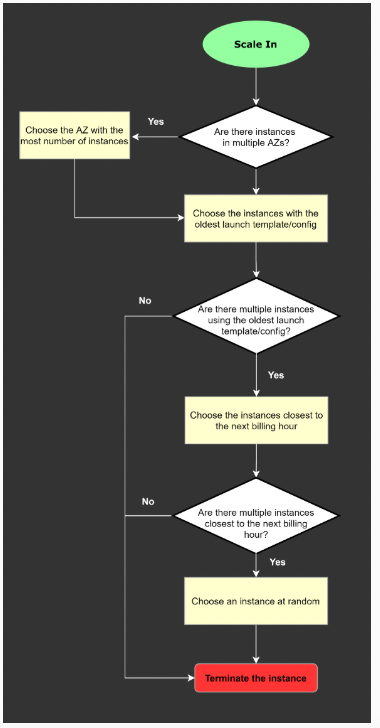

**The following notes are from various practice exams**

## Takeaways from Practice Exams ##

### Compute ###
- `AWS Batch` automatically manages the underlying infrastructure, scales based on workload and simplifies batch job management.
- `CloudFront Match Viewer` is an Origin Protocol Policy that configures `CloudFront` to communicate with your origin using HTTP or HTTPS, depending on the protocol of the viewer request
    - A `custom origin` can point to an on-premises server and `CloudFront` is able to cache content for dynamic websites. `CloudFront` can provide performance optimizations for custom origins even if they are running on on-premises servers. 
- The `AWS Reserved Instance Marketplace` is a place to buy and manage `Reserved Instances (RIs)` for `Amazon Elastic Compute Cloud (Amazon EC2)` and` Amazon Relational Database Service (Amazon RDS)`. `RIs` are billing discounts that can save users money compared to on-demand pricing. 
- Only Standard `RIs` can be sold at the `Reserved Instance Marketplace.`
- `AWS Compute Optimizer` recommends optimal AWS resources for your workloads to reduce costs and improve performance by using machine learning to analyze historical utilization metrics. Overprovisioning resources can lead to unnecessary infrastructure costs, and underprovisioning resources can lead to poor application performance. `Compute Optimizer` generates recommendations for the following resources:
    - `Amazon Elastic Compute Cloud (Amazon EC2) instances`
    - `Amazon EC2 Auto Scaling groups`
    - `Amazon Elastic Block Store (Amazon EBS) volumes`
    - `AWS Lambda functions`
- data transfer between `EC2` instances in the same `AZ` is **free**, while transferring data across `AZs` incurs additional charges. Keeping all instances in the same `AZ` minimizes data transfer costs while maintaining efficient processing.

### Data Migration 
- `AWS Application Migration Service` enables lift-and-shift migrations by replicating VMs from the on-premises data center to AWS
    - `AWS Sever Migration Service` has been deprecated in favor of AWS Application Migration Service, which provides a more streamlined and modern approach to lift-and-shift migrations.

### Organizations 
- `AWS Control Tower` simplifies account setup with built-in security guardrails. It minimizes operational overhead by automating VPC sharing and guardrail enforcement through AWS RAM.
- `Service Control Policies (SCP)` are used to enforce policies across accounts in an organization
- `Tag policies` enforce tagging standards for AWS resources. By attaching the tag policy to the OU, you ensure that all `EC2` instances follow the defined tagging requirements.
- `AWS Resource Access Manager (RAM)` is a service that enables you to easily and securely share AWS resources with any AWS account or within your `AWS Organization`. You can share AWS Transit Gateways, Subnets, AWS License Manager configurations, and `Amazon Route 53 Resolver` rules resources with RAM.

### IAM
- `IAM Roles Anywhere` provides a secure and scalable method for on-premises workloads to obtain **temporary** AWS credentials. It avoids the use of long-term credentials and integrates with `IAM Identity Center `to ensure least privilege access to the `S3` bucket.
- `AWS Gateway Load Balancer` is specifically designed to simplify the deployment of security appliances. Using `GWLB` endpoints in service accounts ensures efficient routing and centralized inspection of traffic.

### Notifications and decoupling
- `AWS EventBridge` is not suitable for handling high-frequency batch image processing tasks
- `Amazon Simple Queue Service (SQS)` is a fully managed message queuing service that enables you to decouple and scale microservices, distributed systems, and serverless applications. `SQS` eliminates the complexity and overhead associated with managing and operating message-oriented middleware and empowers developers to focus on differentiating work.

### Gateways

| Gateway Type          | Protocol(s) Supported | Client File System (Typical) | Use Case                                                                                                    |
|-----------------------|----------------------|-----------------------------|-------------------------------------------------------------------------------------------------------------|
| File Gateway          | NFS, SMB             | NTFS (Windows via SMB) / Any POSIX FS (Linux via NFS) | Stores files as objects in S3, providing a file-based interface for applications.                             |
| Volume Gateway        | iSCSI                | Any FS supported by the OS    | Offers block storage volumes backed by S3 or EBS, suitable for high-performance, low-latency applications. |
| Tape Gateway          | iSCSI-VTL            | N/A (Emulates a tape library) | Simplifies tape-based backups to AWS, providing a cost-effective solution for long-term archival.           |
| Amazon FSx File Gateway | SMB                  | NTFS                         | Provides a local cache for frequently accessed files on Amazon FSx for Windows File Server.                 |          |

- `Amazon FSx File Gateway` to support the `SMB` file share for the on-premises application
- `AWS Transit Gateway` provides a hub and spoke design for connecting VPCs and on-premises networks.
    - `AWS Transit Gateway` also enables you to scale the IPsec `VPN` throughput with `equal-cost multi-path (ECMP)` routing support over multiple `VPN` tunnels. A single VPN tunnel still has a maximum throughput of 1.25 Gbps. If you establish multiple VPN tunnels to an `ECMP-enabled transit gateway`, it can scale beyond the default limit of 1.25 Gbps.
- `AWS Transfer for SFTP` enables you to easily move your file transfer workloads that use the Secure Shell File Transfer Protocol (SFTP) to AWS without needing to modify your applications or manage any SFTP servers.

### File Services 
| Service/Storage Type | Type of Storage | Protocol(s) | File System(s) | Use Cases                                                                                                  | Scalability/Performance |
|----------------------|-----------------|-------------|----------------|-------------------------------------------------------------------------------------------------------------|------------------------|
| Amazon EFS           | File            | NFS v4      | EFS            | Shared file storage for Linux-based applications, web serving, content management, big data analytics.        | Highly scalable       |
| Amazon FSx for Windows File Server | File | SMB | NTFS | Shared file storage for Windows-based applications, enterprise applications, home directories.                               | Highly scalable       |
| Amazon FSx for Lustre | File | Lustre | Lustre | High-performance computing, machine learning, video processing, and other workloads requiring fast parallel access. | Extremely high performance |
| Amazon FSx for NetApp ONTAP | File | NFS, SMB, iSCSI | ONTAP | Enterprise applications, lift-and-shift of NetApp environments, hybrid cloud storage, general-purpose file sharing. | Highly scalable       |
| Amazon S3            | Object          | HTTP/HTTPS  | N/A (Object Storage) | General-purpose storage, data lakes, backups, archives, media storage.                                        | Massively scalable    |
| Amazon EBS           | Block           | N/A (Block Device) | Various (ext4, XFS, NTFS, etc.) | Block storage for EC2 instances, operating systems, applications, databases.                                  | Scalable             |

- `Amazon FSx for OpenZFS` does provide high-performance storage and delivers sub-millisecond latency, but it does not fulfill the requirement of providing multi-protocol access to the data such as SMB and iSCSI protocols. This particular `Amazon FSx` type allows sharing files using NFSl only.
- `Amazon FSx for Windows File Server` provides fully managed, highly reliable file storage that is accessible over the industry-standard Server Message Block (SMB) protocol. `Amazon FSx` is built on Windows Server and provides a rich set of administrative features that include end-user file restore, user quotas, and `Access Control Lists (ACLs)`.Additionally, `Amazon FSX for Windows File Server` supports `Distributed File System Replication (DFSR)` in `Single-AZ` deployments as can be seen in the feature comparison table below.
    - Uses `NTFS`
    - `AWS EFS` is only for linux

- `Amazon Elastic File System (Amazon EFS)` provides a simple, scalable, fully managed elastic NFS file system for use with AWS Cloud services and on-premises resources. It is built to scale on-demand to petabytes without disrupting applications, growing and shrinking automatically as you add and remove files, eliminating the need to provision and manage capacity to accommodate growth.
- `Amazon EFS` provides scalable file storage for use with Amazon `EC2`. You can use an EFS file system as a common data source for workloads and applications running on multiple instances. The `EC2` instances can run in multiple `AZs` within a `Region` and the `NFS protocol` is used to mount the file system.
    - With `EFS` you can create mount targets in each AZ for lower latency. The application instances in each AZ will mount the file system using the local mount target.

### AI 
- `Amazon Kendra` an intelligent search service.
- `Amazon Polly` a cloud service that converts text into speech
- `SageMaker Clarify `is a tool designed for detecting bias and providing explainability for machine learning models
- `Amazon Comprehend Medical` uses advanced machine learning models to accurately and quickly identify medical information such as medical conditions and medication and determine their relationship to each other, for instance, medication and dosage. You access `Comprehend Medical` through a simple API call, no machine learning expertise is required, no complicated rules to write, and no models to train.

### Data sync and backup and storage 
- Can use `AppSync` with DynamoDB to make it easy for you to build collaborative apps that keep shared data updated in real-time
    - GraphQL Api
    - `AppSync pipeline resolvers` offer an elegant server-side solution to address the common challenge faced in web applications—aggregating data from multiple database tables. 
- `Amazon AppFlow` is simply an integration service for transferring data securely between Software-as-a-Service (SaaS) applications like Salesforce, SAP, Zendesk, Slack, ServiceNow, and AWS services.
- `AWS Backup` is a centralized backup service that makes it easy and cost-effective for you to backup your application data across AWS services in the AWS Cloud, helping you meet your business and regulatory backup compliance requirements
- `AWS physical Snowball Edge` device will provide much more inbuilt compute and storage compared to the current team’s laptops. This negates the need to rely on a stable connection to process any images and solves the team's problems easily and efficiently.

### S3
- You can’t have an `Amazon S3 managed encryption key` for client-side encryption. As its name implies, an `Amazon S3 managed key` is fully managed by AWS and also rotates the key automatically without any manual intervention
- `Expedited retrievals` allow you to quickly access your data when occasional urgent requests for a subset of archives are required. For all but the largest archives `(250 MB+),` data accessed using `Expedited retrievals` are typically made available within `1–5 minutes`. `Provisioned Capacity` ensures that retrieval capacity for `Expedited retrievals` is available when you need it.
    - `Provisioned capacity` ensures that your retrieval capacity for `expedited retrievals` is available when you need it. Each unit of capacity provides that at least three `expedited retrievals` can be performed every five minutes and provides up to `150 MB/s` of retrieval throughput. 
- `Amazon S3 access points` simplify data access for any AWS service or customer application that stores data in `S3`. `Access points` are named network endpoints that are attached to buckets that you can use to perform S3 object operations, such as `GetObject` and `PutObject`.
- `An Amazon S3 Glacier (Glacier) vault` can have one resource-based vault access policy and one `Vault Lock policy` attached to it. A `Vault Lock policy` is a vault access policy that you can lock. Using a `Vault Lock policy` can help you enforce regulatory and compliance requirements
- `Amazon S3 Storage Lens` offers a robust analytics solution that provides comprehensive visibility into object storage usage and activity across an organization. Through an interactive dashboard on the S3 Management Console, users can access metrics like storage usage, object counts, and versioning status, along with actionable recommendations for cost optimization and security improvement. Data can also be exported for deeper analysis using tools such as Amazon QuickSight, Athena, or Redshift.
- You can only add 1 `SQS` or `SNS` at a time for `Amazon S3 `events notification

### Networking
- A `subnet` can only be associated with one `route table` at a time, but you can associate multiple subnets with the same subnet `route table`. You can optionally associate a `route table` with an `internet gateway` or a `virtual private gateway` (gateway `route table`). This enables you to specify routing rules for inbound traffic that enters your `VPC` through the `gateway`
- `VPC` endpoints for `S3` and `DynamoDB`
    -  `gateway` - used for AWS Services
    - `interface` - used for external services
        -  an elastic network interface with a private IP address from the IP address range of your subnet. Unlike a Gateway endpoint, you still get billed for the time your interface endpoint is running and the GB data it has processed. 
- `Elastic Network Interface (ENI)` -  virtual network interface that can be attached to an `EC2` instance in a `Virtual Private Cloud (VPC`).
    - the private IP is assigned to the `ENI` not the `EC2`
    - the `ENI` can be moved to a different server if required
- `EFA` provide OS bypass ability for Linux systems
    - not supported for windows
    - supports HPC workloads
- An `Elastic Fabric Adapter (EFA)` is simply an` Elastic Network Adapter (ENA) `with added capabilities. It provides all of the functionality of an `ENA`, with additional OS-bypass functionality. OS-bypass is an access model that allows `HPC` and machine learning applications to communicate directly with the network interface hardware to provide low-latency, reliable transport functionality. 
    - OS bypass not supported by windows
- you can’t assign an Elastic IP address to an `Application Load Balancer`
- `AWS PrivateLink` (which is also known as VPC Endpoint) is just a highly available, scalable technology that enables you to privately connect your VPC to the AWS services as if they were in your VP
- `AWS PrivateLink` enables private connectivity between VPCs and supported AWS or third-party services, ensuring that traffic does not traverse the public internet.
- `AWS VPN` connections are typically used for secure communication between on-premises environments and AWS

### Billing 
- stopping – The instance is preparing to be stopped. Take note that you will not billed if it is preparing to stop however, **you will still be billed if it is just preparing to hibernate.**
-  Keep in mind that an `EC2 instance` has an underlying physical host computer. If the instance is stopped, `AWS` usually moves the instance to a new host computer. Your instance may stay on the same host computer if there are no problems with the host computer

### DBs
- `Babelfish for Aurora PostgreSQL` is an extension designed for` Amazon Aurora PostgreSQL`. It allows the database to interpret commands from applications developed for Microsoft SQL Server. By serving as a translation layer, it converts T-SQL (Microsoft’s SQL dialect) into PostgreSQL, enabling SQL Server applications to run directly on `Aurora PostgreSQL` with minimal or no changes required to the code.
- `Amazon Data Lifecycle Manager `is a service designed to automate the management of `Amazon EBS snapshots and volumes`, which significantly reduces operational overhead. By deleting expired and unused snapshots and setting up lifecycle policies for new snapshots, companies can ensure that only necessary snapshots are retained, thereby optimizing costs associated with storage. This service allows for the automated deletion of outdated snapshots based on policies defined by the user, which eliminates the need for manual monitoring and deletion, a task that can be both time-consuming and error-prone.
- `Amazon Aurora Global Database` is designed for globally distributed applications, allowing a single `Amazon Aurora database` to span multiple `AWS regions`. It replicates your data with no impact on database performance, enables fast local reads with low latency in each region, and provides disaster recovery from region-wide outages.
    - You can invoke an `AWS Lambda` function from an `Amazon Aurora MySQL-Compatible Edition DB` cluster with a native function or a stored procedure
- `RedShift` is a data warehouse and used for running analytics queries on data that is exported from transactional database systems
- `Amazon DynamoDB `and `Amazon S3 `support gateway endpoints, not interface endpoints. With a gateway endpoint you create the endpoint in the `VPC`, attach a policy allowing access to the service, and then specify the route table to create a route table entry in.

### Security 
- `Inspector`: Vulnerability management. Finds weaknesses in your configurations.
- `Detective`: Threat investigation. Analyzes security events to understand what happened.
- `GuardDuty`: Threat detection. Continuously monitors for malicious activity and unusual behavior
- CloudTrail
    - `AWS CloudTrail Lake` lets you run SQL-based queries on your event logs in` AWS CloudTrail`. It provides a robust and efficient way to directly analyze `CloudTrail` logs. `CloudTrail Lake` converts existing events in row-based JSON format to Apache ORC format. ORC is a columnar storage format that is optimized for fast retrieval of data. Events are aggregated into event data stores, which are immutable collections of events based on criteria that you select by applying advanced event selectors.
    - To determine whether a log file was modified, deleted, or unchanged after `CloudTrail` delivered it, you can use `CloudTrail log file integrity validation`. This feature is built using industry-standard algorithms: SHA-256 for hashing and SHA-256 with RSA for digital signing.
    - `CloudTrail Insights Events` is just an optional feature that allows you to detect unusual write API activities in your account.
    - `The CloudTrail Processing Library` is just a Java library that simplifies the processing of `CloudTrail logs`. It's not capable of detecting log tampering.

- `Amazon Cognito `provides user pools, which are user directories, to help handle user registration, authentication, and account recovery. Amazon API Gateway supports Cognito user pool authorizers in authenticating API calls. Using `Amazon Cognito `user pools with `API Gateway` for RESTful APIs allows seamless security and identity management integration, ensuring operational efficiency and scalability suitable for millions of users.
- `Amazon Cognito user pool` is a comprehensive user directory that enables both authentication and authorization mechanisms for web and mobile applications. It operates as an OpenID Connect (OIDC) identity provider, facilitating robust identity verification and management. The user pool enhances security through multiple layers, supports identity federation to allow integrations with other systems, and offers extensive customization options to tailor the user experience and application integration according to specific business needs.

### Containers

- `AWS Proton `allows you to deploy any serverless or container-based application with increased efficiency, consistency, and control. You can define infrastructure standards and effective continuous delivery pipelines for your organization. `Proton` breaks down the infrastructure into environment and service (“infrastructure as code” templates).
- `Karpenter `is a flexible, high-performance Kubernetes cluster autoscaler that launches appropriately sized compute resources, like `Amazon EC2 instances`, in response to changing application load. It integrates with AWS to provision compute resources that precisely match workload requirements.
- `Wavelength Zones` are AWS infrastructure deployments that embed AWS compute and storage services within telecommunications providers’ data centers at the edge of the 5G network, so application traffic can reach application servers running in `Wavelength Zones` without leaving the mobile providers’ network. This prevents the latency that would result from multiple hops to the internet and enables customers to take full advantage of 5G networks. `Wavelength Zones` extend AWS to the 5G edge, delivering a consistent developer experience across multiple 5G networks around the world. `Wavelength Zones` also allow developers to build the next generation of ultra-low latency applications using the same familiar AWS services, APIs, tools, and functionality they already use today.
    - can deploy infra like kubernetes here

### Big Data 
- `AWS Glue DataBrew` is essentially a no-code tool that streamlines the process of preparing data for analysis and machine learning. It’s especially valuable for data professionals looking to clean, normalize, and transform their data more efficiently. One of the standout features of DataBrew is its ability to cut down data preparation time by up to 80% compared to traditional manual methods. This efficiency boost not only accelerates the data preparation process but also allows data analysts and scientists to focus more on extracting insights rather than getting stuck in the initial stages of data processing.
- `AWS Glue Studio’s` visual interface for data transformations, which supports non-coding transformations and could be shared via `AWS Glue jobs`. However, it doesn’t specifically address the requirements for data profiling or data lineage as directly as DataBrew does.
- `AWS Lake Formation` is a service that helps users manage, secure, and set up data lakes in Amazon Simple Storage Service (Amazon S3). It also helps users discover, catalog, cleanse, and transform data. 
    - `AWS Lake Formation Blueprints` are designed to automate the process of data ingestion into the data lake. The "Incremental database" blueprint, in particular, is suitable for loading only new data from the Amazon Aurora MySQL database into the S3 data lake, based on previously set bookmarks. This ensures that the data in the data lake is continually updated with the latest operational data.
- `Amazon Kinesis` enables you to ingest, buffer, and process streaming data **in real-time.** `Kinesis` can handle any amount of streaming data and process data from hundreds of thousands of sources with very low latencies. This is an ideal solution for data ingestion.

### Other Services 
- `Amazon WorkDocs` is commonly used to easily collaborate, share content, provide rich feedback, and collaboratively edit documents with other users.
- `AWS Artifact `is your go-to, central resource for compliance-related information that matters to you. It provides on-demand access to AWS’ security and compliance reports and select online agreements
- `AWS Health` provides ongoing visibility into your resource performance and the availability of your AWS services and accounts. You can use` AWS Health` events to learn how service and resource changes might affect your applications running on AWS.` AWS Health` provides relevant and timely information to help you manage events in progress.` AWS Health` also helps you be aware of and to prepare for planned activities.
- `AWS Systems Manager Run Command` lets you remotely and securely manage the configuration of your managed instances. A managed instance is any Amazon EC2 instance or on-premises machine in your hybrid environment that has been configured for Systems Manager
- `The Instance Scheduler on AWS solution` automates the starting and stopping of `Amazon Elastic Compute Cloud (Amazon EC2)` and `Amazon Relational Database Service (Amazon RDS) instances.`
    - This solution helps reduce operational costs by stopping resources that are not in use and starting resources when their capacity is needed. For example, a company can use an Instance Scheduler on AWS in a production environment to automatically stop instances outside of business hours every day. If you leave all of your instances running at full utilization, this solution can result in up to 70% cost savings for those instances that are only necessary during regular business hours (weekly utilization reduced from 168 hours to 50 hours).
- `AWS Config` cannot prevent resource creation or modification. It can detect noncompliance but requires additional tools like `Lambda` for remediation, which introduces operational overhead.

## From Official AWS Practice Exam ##

- `Amazon Cognito` provides authentication, authorization, and user management for your web and mobile apps. Users can sign in directly with a user name and password, or through a trusted third party
- You can use `AWS STS` to create and provide trusted users with temporary security credentials that can control access to your AWS resources. However, `AWS STS` does not control access to an application.
- For `SnowBalls Edged Device `base price covers the device and 10 days of usage at the on-premises location. If the company returns the device within a week, the company pays the base price and the price for data transfer out of AWS.
- `AWS Shield` provides protection against DDoS attacks. Shield cannot be a target of routes in a route table
- The only way to retrieve instance metadata is to use the `link-local address`, which is 169.254.169.254.
- `Amazon GuardDuty` is a threat detection service that continuously monitors for malicious activity and anomalous behavior. It does not scan for vulnerabilities.
- You can use `Patch Manager` to apply patches for operating systems and applications
- `Amazon Inspector `removes the operational overhead that is necessary to configure a vulnerability management solution. `Amazon Inspector `works with both EC2 instances and container images in Amazon ECR to identify potential software vulnerabilities and to categorize the severity of the vulnerabilities
- This is a pilot light DR strategy. This solution recreates an existing application hosting environment in an `AWS Region`. This solution turns off most (or all) resources and uses the resources only during tests or when DR failover is necessary. RPO and RTO are usually 10s of minutes.
-  By default, the Application Load Balancer waits 300 seconds before the completion of the deregistration process, which can help in-flight requests to the target become complete. To change the amount of time that the Application Load Balancer waits, update the deregistration delay value.
- Components of a VPN connection:
    - A `customer gateway` is required for the VPN connection to be established. A customer gateway device is set up and configured in the customer's data center.
    - A` virtual private gateway` is attached to a VPC to create a `site-to-site VPN connection to AWS`. You can accept private encrypted network traffic from an on-premises data center into your VPC without the need to traverse the open public internet.