# AWS Certified Solutions Architect Associate SAA-C03 Course Code
*By [Digital Cloud Training](https://digitalcloud.training/) - Course Author Neal Davis*


**Sections**
1. [Global Services Index](#global-services)
2. [Identity and Access Management (IAM)](#iam)
3. [Elastic Compute Cloud (EC2)](#ec2)
4. [Elastic Load Balancing and Auto Scaling](#elastic-load-balancing-and-auto-scaling)
5. [AWS organizations](#aws-organizations)
6. [AWS Virtual Private Cloud (VPC)](#aws-virtual-private-cloud-vpc)
7. [Amazon Simple Storage Service (S3)](#amazon-simple-storage-service-s3)
8. [DNS, Caching and Performance Optimization](#dns-caching-performance-optimization)
9. [Block and File Storage Systems](#block-and-file-storage)
10. [Docker Containers And ECS](#docker-containers-and-ecs)
11. [Serverless Applications](#serverless-applications)
12. [Database and Analytics](#database-and-analytics)
13. [Deployment And Management](#deployment-and-management)
14. [Monitoring, Logging and Auditing](#monitoring-auditing-and-logging)
15. [Security In teh Cloud](#security-in-the-cloud)
16. [Migration and Transfer](#migration-and-transfer)
17. [Web, Mobile, ML, Cost Management](#web-mobile-ml-cost-management)

## Global Services ##
- IAM
- CloudFront
- Billing and Cost Management
- Route53
- AWS Organization
- AWS Artifact
- AWS Health Dashboard
- S3 (from a bucket name perspective)

## IAM ###
- https://digitalcloud.training/aws-iam/
- Users: `IAM` users are individuals or applications that you create in AWS to grant them access to your AWS resources.
    - long term
- Groups: `IAM` groups are collections of `IAM` users that you can use to simplify permissions management by assigning permissions to the group instead of individual users.
- Roles: `IAM` roles are sets of permissions that you can assign to AWS resources (like `EC2` instances) or federated users, allowing them to assume specific permissions without having long-term credentials.
    - short term
    - have `Trust Relationships` which define who/what can assume this role
- Policies: `IAM` policies are documents that define permissions for users, groups, or roles, specifying which actions they can perform on which resources.
    - Policies are the rules.   
    - Users, groups, and roles are who the rules apply to.
```
{
    "Version": "2012-10-17",
    "Statement": [
        {
            "Effect": "Allow",
            "Action": "*",
            "Resource": "*"
        }
    ]
}
```

### Best Practices ###
- Do not use the root user
- Create an admin user, then create a regular user to take actions with 
  - this follows principle of least privilege and only use the account with the least amount of privilege required
- Create groups to put users into for easy reassignment of permissions 
- see: https://docs.aws.amazon.com/IAM/latest/UserGuide/best-practices.html


### Auth Methods ###
- MFA - 2 of the following
    - something you know - ie: passwords
    - something you have - ie: token/authenticator
        - security key
        - mobile auth app
        - time based on time passwords (TOTP)
    - something you are- ie: biometrics 
- `Access Keys` - programmatic 
    - used for CLI or other API endpoints
    - `Access Key ID` and `Secret Key`

### Permission Boundaries ###  
- Sets maximum permissions an entity can have
- Assigned to users and roles
- Even if you have a policy, the boundary will restrict the max permissions the user can have
- Helps to mitigate privilege escalation
  - ie: something who only has `IAM` flags could create a user and given them admin access
    - can give someone `IAM` Full access but add a permission boundary that says the users this user creates can only have same or lower permissions as the current user

### Evaluation Logic ###
 
1. explicitly deny
2. organization policy
3. resource policy
4. identity policy
5. `IAM` permission boundary
6. Session policy


- Requests are implicitly denied by default 
    - Root user has full access
- Explicit deny overrides any allows 


### IAM Policy Structure ###
- Everything in AWS is an api call
- Each service has a set of actions
    - example `"Action": "s3:GetObject"`
- `IAM` Policies are are written in JSON
```
{
    "Version": "2012-10-17",
    "Statement": [
        {
            "Effect": "Allow",
            "Action": [
                "logs:CreateLogGroup",
                "logs:CreateLogStream",
                "logs:PutLogEvents",
                "s3-object-lambda:WriteGetObjectResponse"
            ],
            "Resource": "*"
        }
    ]
}
```
- The only effects are `allow` or `deny`
- Action - list specific operations this policy affects
- Resource - which resource these actions can be performed on
- `*` - wildcard - signifies all from this point


## EC2 ##
- https://digitalcloud.training/amazon-ec2/
- Virtualized servers run in AWS data centers
    - use Zen and Nitro virtualization software
    - Virtualization Stack - IAAS
- Chose the OS, Instance Type, resources
- Can be assigned public IP
    - Assigned automatically when in a `public subnet`
    - IP is lost when instance is stopped
    - Associate with a private instance address
- Call instances have private IP address
- Can assign an `elastic ip`, which is a static public IP
    - you are charged while it is not used

### Subnet Types ###
- `AZ` can hold subnets, private and public
- Instances can be launched into `private subnets`
    - should deploy here whenever we can 
    - can then use a `load balancer` in a `public subnet` to route traffic to them
    - Can deploy a `NAT Gateway` in the `public subnet` for downloading things from the internet like dependency updates
    - `Nat Gateways` Only Allow outbound traffic
- `Subnets` have routes assigned to them
    - Public Subnet Table
        - `172.31.0./15 : local`
        - `0.0.0.0 : igw-id` (mapped to the `internet gateway`)
    - Private Subnet table 
        - `172.31.0./15 : local`
        - `0.0.0.0 : nat-gateway-id` (lives in `public subnet` which then send traffic to internet gateway)

### Launching EC2 ###
- chose [instance type](https://aws.amazon.com/ec2/instance-types/)
- chose AMI (includes OS and software)
    - back by a snapshot (point in time backup)
    - create create our own custom `AMI`

### Instance Metadata ###
- can be curled by `curl http://[ip]/latest/meta-data
- includes various data such as AMI-ID, hostname, etc...
- 2 versions of the instance metadata service
    - v1 - older and less secure
    - v2 - default, newer, more secure, requires authorization via session token
- `User Data` - ability to supply a script to run when the VM launches
    - can be configured in the management console or cli
    - in the cli the user data is passed in via file
    - must be base64 encoded
    - limited to 16kb
    - only runs the first time the instance is launched
- In AWS `EC2`, `169.254.169.254` is the default gateway for instances. It's a virtual IP address that allows instances to access the Instance Metadata Service (IMDS).
    - ex: `curl http://169.254.169.254/latest/meta-data/instance-id`
        - will give us the instance id
    - see [user-metadata-md](./aws-saa-code-main/amazon-ec2/user-data-metadata.md) for more

### User Data ###
- can be given to `EC2` as a script to run on startup in order to configure the instance
- always converted to base64
- only runs one time when the instance starts
- max 16kb


### Access Keys vs Roles With EC2 ###
- AWS CLI uses access keys
    - Access Keys are associated with a user account and inherit that users permissions
    - **This can give `EC2` instance permissions but access keys are long term credentials and stored in plain text**
    - Access keys are configured with `aws configure`
- Should instead use `IAM` roles for services
    - temporary credentials where permissions are inherited just for the time that is required to perform the action
    - nothing is stored on the instance 
    - `EC2 Assumes the role`
    - These credentials are like short term access keys that are renegotiated when the role needs to be assumed.

### Status Checks And Monitoring ###
- Status Checks 
    - System Status Check - checking if underlying hardware is running
        - aws is going to have to fix this issue
    - Instance Status Check - checking the software and networking configuration
        - you may be able to fix this issue
- Monitoring
    - the monitoring tab shows various metrics that are sent to the `AWS Cloudwatch` service
    - By default metrics are sent to `CloudWatch` every 5 mins for free
    - `Detailed Monitoring` can be enabled for more frequent (every 1 minute) reporting but this will cost $$    
        - `CloudWatch` detailed monitoring is enabled by default when creating launch configurations through the CLI.

### EC2 Placement Groups ###
- A way to control how AWS deploys `EC2` and what `AZ` they are in

- `Cluster` - packs instances closely within the same `AZ`, as opposed to randomly
    - achieves low-latency network performance
    - good for tightly couple node to node communication for HPC applications 

- `Partition` - spreads instances across logical partitions
    - redundancy, so machines in the same partition do not share the same hardware
    - good for distributed workloads such as a HDFS, Cassandra and KAfka

- `Spread` - places a small group of instances across distinct underlying hardware


### Network Interfaces ###
- 3 Types
    - `ENI` - elastic network interface
    - `ENA` - elastic network adapter
        - must have the ENA module installed and enabled
            - Amazon Linux has this by default
    - `EFA` - elastic fabric adapter
        - Used for HPC
- when launching an `EC2`, the `EC2` sits in the `AZ` and it attaches to an Adapter in the subnet
- can connect multiple Adapters from different subnets to the same `EC2` but the subnets must be in the same `AZ`
- Cannot remap adaptors across `AZ`


### Types of IPs ###
- Public - dynamic, changes with stops and starts of instances
- Private - used in `private subnet` only
- `Elastic IP` (EIP) - a public ip that is static
    - can be assigned to network interfaces
    - can be remapped across `AZ`'s
    - you get charged when these are allocated to the account but not in use

###  NAT For Public Addresses ###
- Network Address Translation (NAT)
- Public IP addresses do not exist anywhere on the `EC2`
- The public address is translated to the private and vice versa by the `Internet Gateway`


### Private Subnets and Bastion Hosts ###
- https://digitalcloud.training/ssh-into-ec2-in-private-subnet/
-  A `bastion host` in AWS is a special-purpose instance that acts as a secure gateway to your private network within a Virtual Private Cloud (VPC). It sits in a public subnet, meaning it has a public IP address and can be accessed from the internet.
- Within a region we have a vpc, `AZ` and `public subnet`
- the `public subnet` has a route table in it which has a route to the local network and route to public internet 
- `private subnet`s cannot be connected to the internet, there is no route option
    - this is the default for new subnets


- can launch 2 `EC2`s, 1 in `public subnet` and 1 in `private subnet`
    - have an internet gateway and want to communicate from the outside to a computer in the `private subnet`
    - can send a request to the `EC2` in the `public subnet` which can then route the request from internet, across the private ip routes 

### NAT Gateways and Instance Overview ###
- Can be used with bastion host for outbound only connection
    - ie download software or outside service
    - no one from the outside should be able to connect
- We can deploy the `NATGateway` into the `public subnet` so that it can get it a public ip
    - this will allow it to proxy traffic from the private `EC2` to the internet
    - **alway deploy nat gateways or nat instances into a public subnet**
    - the `NatGateway` ID is added to teh `private subnet` route table 
    - Managed service
    - Can scale horizontally
    - Has high availability, can be deployed in multi-az
    - outbound access only, no security groups
    - **needs elastic ip**
    - need to add a route to the route table in private route table


- `NAT Instance` - an `EC2` that does the same thing as a `NatGateway` but runs from and `EC2` instance
    - not used much anymore
    - uses special ami `amzn-ami-vpc-nat` 
    - **must disable source and destination checks**
    - **managed by you!!**
    - can only scale out
    - not highly available
    - uses security groups
    - could make this dual purpose so it is actually your bastion host if you wanted 


### EC2 Instance LifeCycle ###

- Stopping
    - Can only stop instances for EBS backed instances
    - `EC2` does not charge for stopped instance but EBS volumes do charge
    - Data in ram is lost
    - Instance is migrated to a different host
    - Private IPV4/6 are retained, public IPV4 are released
- Hibernating 
    - applies to supported AMI
    - contents of RAM saved to EBS volume
    - Must be enabled for hibernation at launch
    - Specific pre-reqs apply
    - When started (after hibernation)
        - Ebs root volume is restored
        - RAM is reloaded
        - Processes resumed
        - Data volumes reattached
        - Retains instance ID
- Rebooting 
    - equivalent to OS reboot
    - DNS named and all IPV4/6 addresses are retained
    - Does not affect billing
- Retiring
    - Instance may be retired if AWS detects irreparable failure to hardware
    - Stopped or terminated when retirement time is reached 
- Terminated
    - deleting and instance
    - cannot recover
    - by default root EBS volumes are deleted
- Recovering 
    - `CloudWatch` can be used to monitor system status and recover if needed
    - Applies if the instance becomes impaired due to underlying hardware / platform issues
    - Recovered instance is identical to original instance

### Nitro Instances and Nitro Enclaves ###
- Nitro is the underlying platform for next generation of `EC2`
- Supports virtualized and bare metal instances
    - Trying to eliminate virtualization performance instances
- The AWS Nitro system does have dense storage instance options
- Specialized hardware 
    - Nitro cards for VPC
    - Nitro cards for EBS
    - Nitro for Instance Storage 
    - Nitro card controller
    - Nitro security chip
    - Nitro hypervisor
    - Nitro Enclave
- Improves performance, security and innovation
- Nitro Enclaves
    - isolated compute environments
    - hardened vms
    - no persistent storage, external access or interactive access
    - cryptographic attestation
    - integrates with aws KMS (Key Management Service)
    - Protect and securely process sensitive data like PII

### EC2 Pricing Options ###
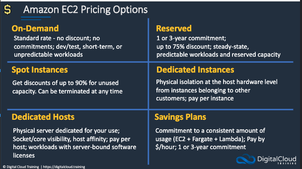
- Commercial linux distros such as RHEL use hourly pricing 
    - minimum of 1 hour
- Amazon linux and other OS are biller per second with a minimum of 1 minute
- `EBS volumes` are per second with a min of 1 minute
- Reserved instances
    - term is 1 or 3 years
    - standard and convertible RI
        - standard: change `AZ`, instance size and network type with `ModifyReservedInstances` API
        - Convertible - can change all of standard and family, OS, tenancy, payment option with `ExchangeReservedInstances` API
    - can pay all up front, partial up front, no up front
    - can reserve capacity in a specific `AZ` but does not reserver capacity when specified by region
    - tenancy can be default or dedicated 
- On Demand Capacity reservation 
    - reserve in specific `AZ`, for any duration
    - mitigates risk of being unable to get On-Demand Capacity
    - Does not require any term commitments and can be cancelled at any time 
- Savings Plans 
    - Compute Savings Plan:  1 or 3 year, hourly commitment to usage of `Fargate`, `Lamdba` and `EC2`, any region, family, size, tenancy and OS
    - `EC2` Savings Plan:  or 3 year, hourly commitment to usage of `EC2`, within a selected region and instance family; any size tenancy and OS
- Spot Instances 

- can ask for a spot block to get 1-6 hours of uninterrupted compute
- pricing is 30% to 45% discount 

### EC2 Pricing Use Cases ###


## Elastic Load Balancing and Auto Scaling ##
- https://digitalcloud.training/auto-scaling-and-elastic-load-balancing/

### Scaling Up vs Scaling Out ###
- Stateful applications - the application needs to remember user information
    - eg: shopping site
- Stateless application - no state about the user is remember by the app
    - eg: weather app
- Generally want to keep the web server stateless by putting user data in cookies, caches and dbs

- Scaling up: add more resources to the same server
    - ie: changing the instance type of the `EC2`
    - SQL DB's are generally scaled up
- Scaling out: add more servers of the same size
    - ie: running more of the same instance
    - static web servers are generally scaled out 


### Amazon EC2 AutoScaling ###

- Automatically launch or terminate instances based on capacity and health
- Works with `EC2`, `ECS`, `EKS`
- Integrates with:
    - `CloudWatch` for monitoring and scaling
    - `Load Balancer` for distributing connections
    - `VPCs` to be deployed in different `AZ`
- Autoscaling - scales horizontally providing elasticity and scalability
    - Responds to `EC2` Status Checks
    - Can scale on demand or schedule
    - Scaling policies define how to respond to changes in demand


- Need to setup and Auto Scaling Group
- Launch Template: specifies the instance configuration
    - additionally health checks, vpc, subnets, purchase options etc...
- Health checks:
    - `EC2` - comes with health checks checking if the machine is ok
    - `ELB` - load balancer is checking if the instances are alive
    - `Health Check Grace Period` - how long to wait until the health is checked
        - Auto scaling does not act until this has been satisfied
    - You should use both `EC2 status checks` and `ELB health checks`. If you select `ELB health checks` both are used automatically. This configuration ensures that the `ELB` does not forward traffic to instances determined by `EC2` status checks to be unhealthy.
- Auto Scaling types
    - Manual - make changes manually
    - Dynamic - based on demand 
    - Predictive - uses ML
    - Scheduled - based on schedule 

- Steps
    1. Create a `launch template`
        - defines what to run when ASG scales
    2. Create an `ASG`
        - will spread the instances across the `AZ`s by default
        - can create dynamic, scheduled or predictive scaling policies
        - of there are less instances than the min alloted it will launch new instances 
            - this happens based on `EC2 health checks`
    3. Create the `target group`
        - do not statically assign targets
    4. Create the `LB`
        - LB and auto scaler must have the same subnets to work together correctly
    5. Once complete go back to `ASG` and assign the `load balancer` to be able to automatically assign targets

### High Availability and Fault Tolerance ###
- High availability - minimal service interruption, no spof, uptime measured in 9's
    - Services to use aer ELB, Auto Scaling and Route 53
- Fault Tolerance - no service interruption, specialized hardware, no downtime
    - Services to use: fault tolerant NIC, disk mirroring (RAID), db replication and redundant power 


- When a server fails aws Auto Scaling will replace the server 
- If an entire `AZ` fails we still have 2 web servers alive in a different `AZ`
- The Load Balancer will make sure to route traffic appropriately
- Durable: how often data is lost
- Available: how often we can access the data 

### Elastic Load Balancing ###
- Provides high availability
- Can target: `EC2`, ECS, IP Addresses, lambdas etc...

- LBs listen to a target group
    - will keep track of instances with health checks
    - reconnect users if instances go down
    - can tell auto scaling that an instance needs to be restarted 
- Will try and spread the load across available instances
- Auto scaler notifies the ELB when a new instance is launched
- Types:
    - `Application LB` - Http/s, layer 7, path based routing 
        - used for web apps, microservices, docker containers, lambdas
        targets can be instance, ip lambda
    - `Network LB` - TCP/UDP, layer 4, high performance and low latency, tls offloading at scale, static ips in each EZ
        - used for TCP and UDP, low latency, static IP and VPC endpoints
        - targets can be instance, ip and `ALB`
    - `Gateway LB` - Layer 3, virtual appliances like firewalls, IPS, IDS
        - Deploy scale and managed 3rd party network alliances, provides centralized monitoring
        - Uses the GENEVE Protocol on 6081

### ALB and NLB Deployments ###
- Instances are registered in target groups


- `ALB` offers advance request routing such as path routing
    - can look at information in http header and send to different target groups based on this info
    - can also do host based routing 
- `NLB` can forward traffic based on ips
    - can assign static ip in each subnet 
    - routed based on ip protocol data such as port number 


- `ALB` uses the private ip of the LOAD Balancer of the source 
- `NLB` uses the source IP of the client making the request if the instance is specified by ID
    - the NLB uses its private IP if the instance is specified by IP address and using HTTP/S
- Can enabled the `x-forwarded-for` header to alway keep track of the original client ip


### EC2 Scaling Policies ###

- Target Tracking - scales based on a target metric value such as average CPU usage across the `AZ`, aims to keep metric close to the target
    - recommended by AWS
    - recommended 1 minute frequency
- Simple Scaling - scales based on an alarm, when cpu > 60% for example it will launch a new instances
- Step Scaling - similar to simple, the amount of instances launched is relative to th size of the breach 
- Scheduled Scaling - set a specific time when to launch a specific number of instances 

| Feature | Target Tracking Scaling | Simple Scaling |
|---|---|---|
| **Scaling Trigger** | Target value for a metric | CloudWatch alarms |
| **Scaling Adjustment** | Automatic, based on algorithms | Predefined, based on alarm configuration |
| **Configuration** | Define target value and metric | Define alarms and scaling adjustments |
| **Proactive Scaling** | Yes | No |
| **Granular Control** | Less | More |


### Cross Zone Load Balancing ###

- When enable each load balancer distributes traffic across register targets in all enabled `AZ`s
    - leads to more even distribution of traffic, especially if the compute is not evenly distributed
- WHne no enabled it only distributes traffic across targets in its own `AZ`
- `ALB` has this enabled
- `NLB` and `Gateway LB` are disabled by default


### Session State and Session Stickiness ###

- Session state can be stored in an external db or cache
    - `elasticache` and `dynamoDb` are used because of low latency and key value store
- Sticky sessions mean the LB should always direct the user to the same instance for the life fo the cookie
    - if the instance fails the user may have to restart
    - can utilize with externalizing the state

### Secure Listeners for ELB ###

- certificates to LB's for SSL and TLS
- `ALB` - supports SSL/TLS Cert
    - If w want encryption all the way to the application instance we will need a certificate at both the LB and the `EC2`
- `Network LB` support ssl/tls certs on the `EC2` for complete encrypted connection 
- Can use `AWS Certificate Manager` to help request certificates for `Route 53 Hosted Zones`


## Aws Organizations ##


- https://digitalcloud.training/aws-organizations/
- create one organization for many accounts
- allow for `service control policies (scp)`
- can consolidate multiple accounts into an organizations that allows for centrally management
- Two Feature Sets:
    - `Consolidate Bill` - only 1 main account gets the bill, 1 card
        - Aggregates usage of services across all accounts which can come with some discounts
        - Includes paying account 
            - independent and cannot access resources from other accounts
            - Credit card is linked to
        - `Linked Accounts`
            - all linked accounts are independent and can use services 
    - `All Features` - gives some additional capabilities including `SCP`
- `Management accounts`, create organizations and add accounts (aka `Master/Management Accounts`)
    - this does not have to be the overall root aws account
    - can group users into organizations units
    - can create account programmatically
    - can use `AWS SSO`
    - Allow for use of `service control policies` to limit permissions per account 
    - The `root` is the top-most container in an `AWS organization's` hierarchy, while the management account is the account that creates the `organization`
- Policies are applied to root accounts or `OUs`

- There are many services and policies that are disabled by default when creating an `organization`
    - must explicitly enable them


### Organization Accounts 


| Feature | Management Account | Member Account |
|---|---|---|
| **Authority** | Highest level of control | Operates within defined boundaries |
| **Creation** | Creates the organization | Created by the management account or invited to join |
| **Policies** | Defines and applies policies | Inherits and implements policies |
| **Billing** | Manages consolidated billing | Contributes to consolidated billing |
| **Access Control** | Sets organization-wide access controls | Manages individual account access |


### Service Control Policies

- SCP control maximum available permissions, they are explicit deny
    - **the do not grant permissions , just limit them**
- SCP can be applied at the OU level 
    - in the example the dev ou can only launch t2.micro
    - the policies flow down stream through the organizational hierarchy
    - **these constraints apply to everyone including admins**
- OUs can be created and have users added to them
- Example SCP
```
{    
  "Version": "2012-10-17",
  "Statement": [
    {
      "Sid": "DenyAccessToASpecificRole",
      "Effect": "Deny",
      "Action": [
        "iam:AttachRolePolicy",
        "iam:DeleteRole",
        "iam:DeleteRolePermissionsBoundary",
        "iam:DeleteRolePolicy",
        "iam:DetachRolePolicy",
        "iam:PutRolePermissionsBoundary",
        "iam:PutRolePolicy",
        "iam:UpdateAssumeRolePolicy",
        "iam:UpdateRole",
        "iam:UpdateRoleDescription"
      ],
      "Resource": [
        "arn:aws:iam::*:{role/name-of-role-to-deny}"
      ]
    }
  ]
}
```
- `Tag Policy` - Tag policies allow you to standardize the tags attached to the AWS resources in an organization's accounts.
    - You can use tag policies to maintain consistent tags, including the preferred case treatment of tag keys and tag values.


### AWS Control Tower

- **extends capabilities of organizations** 
- released after organizations
- sits over the top to add some guardrails
- creates a `landing zone`
    - a well architected multi-account baseline
    - has a whole bunch of preventive guardrails that disallow api actions using SCP
- Integrates with SSO

- Shared accounts with control tower
    - Management Account
    - Log archive account 
        - stores copy of all `aws cloudtrail` and `aws config` log files
    - Audit account
        - aggregates and stores logs collected from other accounts in the landing zone
        - secure account with restricted access
- Preventative Guardrails
    - designed to prevent policy violations before they occur
    - ie: `SCP`
    - example: disallow deletion og `Cloudtrail Logs` and `S3 Logging Buckets`
- Detective Guardrails
    - monitor and report policy violations for non-compliant actives that have already occurred
    -  help identify mis conduct 
    - Use `AWS Config` rules and Lambda Functions 
    - Continuos Evaluation
    - Example: detect publicly accessible `S3 Bucket`


## AWS Virtual Private Cloud (VPC) ##
- Can create 5 VPC's per `Region`
- Each `Region` has a default `VPC`
- Avoid overlapping CIDR Blocks
- https://digitalcloud.training/amazon-vpc/
- https://digitalcloud.training/aws-direct-connect/

### AWS Global Infrastructure ###

- `Regions` hold `Availability Zones (AZ)`
    - distant from each other
- `AZ` are 1 or more physical data centers 
    - have redundant power sources and networking
    - fairly close to each other
- Common to have resources in the same `Region` and Multiple `AZ` as well as in different `Regions` for high availability
- `Regions` are connected by `AWS Local Network`
- `Subnets` are crated within `AZ` 
    - Public Subnets:
        - Must have a route to and `Internet Gateway`
        - Must have `Auto-assign public IPv4 address` set ot `yes` 
- `Direct Connect` 
- `Outposts` - piece of hardware that comes into your data center
    - supports subset of AWS
    - Has connectivity back to AWs region
- `AWS Local Zone` - like AZ in metro politian areas
    - can provide closer connectivity areas
- `Wavelength zones` - for 5G, goal is to lower the delay and latency to your data center


- `Amazon Cloudfront` - aws CDN
    - Have `Regional Edge Cache` 
    - Allows for users around the world to access resources at lower latency
- AWS Allows us to simply deploy services globally from the management console. cli or api

### IP Addressing ###


### Amazon VPC Overview ###

- `Regions` have `VPC`
- `VPC` cannot span `Regions`
- Logically isolated portion of the AWS cloud withing a `Region`
- `AZ's` can be used withing the `VPC`
- `Subnets` are created and aligned to `AZ`
    - cannot assign the same `Subnet` to multiple `AZ`
    - Can have multiple `Subnet` in the same `AZ`
- `VPC Router` - handles routing within and out of the `VPC`
    - You don't handle this, but can configure the `VPC` Rout table
- `Internet Gateway` attaches to `VPC` and used for egress/ingress to the internet
    - only 1 per `VPC`
    - There is an `Egress Only Internet Gateway` that uses IPV6 and only allows egress
- Can create multiple (Up to 5 by default) `VPCs` in a `Region`
    - each `VPC` has its own CIDR block
    - can create the network ID's for the `Subnets`, but they have to be within the CIDR block


- `Peering connection` - connects multiple `VPCs`
- `VPC Endpoint` - private IP can connect to AWs
- `Virtual Private Gateway` and Customer Gateway - deal with creating VPN connections
- `AWS Direct Connect` - allow high speed, private network connection to AWS
    - Avoids public internet


- **VPC is like having your own Data Center in AWS**
    - needs a CIDR blocks
    - Spans all `AZ` in a `Region`
    - Provides complete control over virtual networking 
    - Can create 5 per `Region`
    - Full Access over AWS resources 
    - Default VPC os created in each `Region` with a public `Subnet` by default 

### Defining VPC CIDR Blocks ###

- Size should be between /16 and /28
- Cannot overlap an existing `VPC`
- cannot increase eor decrease and existing size
- **first for and lastIP address are not available for use**
    - this is done at the subnet level
- recommend you use private ip ranges
- `VPC Subnets` have a longer subnet mask than the `CIDR` block they come from

| IP Address | Purpose | Example (CIDR block 10.0.0.0/24) |
|---|---|---|
| Network address | Identifies the subnet itself | 10.0.0.0 |
| VPC router address |  Used by the VPC router for routing traffic | 10.0.0.1 |
| DNS server address | Used for DNS resolution within the VPC | 10.0.0.2 |
| Future use address | Reserved for future use by AWS | 10.0.0.3 |
| Network broadcast address | Used for broadcast communication within the subnet | 10.0.0.255 |


- Bigger blocks give more flexibility
- Smaller `subnets` are OK for most use cases
- Consider deploying applications tiers per `subnet`
- `VPC` peering requires non-overlapping cider blocks
- **Avoid overlapping CIDR blocks**
- Example subnet calculator: https://www.site24x7.com/tools/ipv4-subnetcalculator.html

### Custom VPC ###

- important thing to know here is the difference in the rout tables
- private `subnet` has no connection to the `igw`


### Security Groups and Network ACL ###


- Stateless firewall - must have explicit rules to allow data flow in each direction
- Stateful firewall - allows return traffic automatically if incoming traffic was allowed 

- `Security Group` 
    - instance level 
    - can be applied to instances in any `subnet`
    - stateful firewall - will allow outbound traffic if inbound is allowed
        - this is because of the `outbound rules`
    - only support allow rules (ie: whitelist)
    - `Security Group Chaining` - set inbound or outbound traffic only from another security group
- `Network Access Control List`
    - apply at the subnet level
    - only apply to traffic entering/exiting the subnet
    - stateless firewall
    - process rules in order
        - rules are numbered, and are evaluated in this order
    - support allow and deny rules
    - apply to all instances in the subnet it is associated with


### Amazon VPC Peering ###

- Allow routing between `VPCs` via AWS network
- Enables routing using private IPv4/6 addresses
- **CIDR blocks must not overlap**
- Does not support transitive peering, must mesh the network if we want that 
    - see [AWS Transit Gateway](#aws-transit-gateway)
- `VPC` can be in different `accounts` and `regions`
- Must set up `Security Group` protocols and `Route Tables` for this to work


### Creating Peering Connection ###
- create all resources (VPC, Subnet etc,..)
- Configure `security groups` to allow traffic from the other `VPC` CIDR Block
- `VPC` management console select `VPC peering connection` and fill out the details
- In the other `Region/VPC` must accept the peering request
- The must create the route tables in order to have traffic routed to each other


### VPC Endpoints ###

- `VPC Interface Endpoint` - creates `ENI` in `subnet`
    - allows EC2 to connect to other AWS services but not the internet
    - uses private IP

- `VPC Gateway Endpoint` - uses the **route table** to create a path to the resource
    - `S3` and `DynamoDB` only
    - can allow us to connect from `private subnet` to `s3` bucket without having a public ip
    - can secure this with `IAM` `policies`


- Can create a model where the is a `Service VPC` and `Consumer VPC` for separation of concerns 

- see [these directions](./aws-saa-code-main/amazon-vpc/create-s3-gateway-endpoint.md)

### AWS Client VPN ###

- Way to connect client computer to a AWS data center `VPC` from your computer
- Encrypted End to End
- Create a VPN Endpoint that associates with `subnets`
- Client computer needs a VPN client
    - Establishes connections via SSL/TLS
    - Performs source network address translation between VPC client and `VPC`

### AWS Site to Site VPN ###

- Managed IPSec VPN
- Connect a customer data center/office location into AWS data center
- Allows for use of private IP's 
- AWs creates a `Virtual Private Gateway (VGW)`, customer deploys `Customer Gateway` 
    - allow for an encrypted connection supporting static routes and BGP 
- `Route table` has a route for the CIDR of the external location and send that traffic to the `VGW`
    - Can be used as a backup for `direct connect`


### AWS VPN CloudHub ###

- This is not a service but an architecture pattern when using `Site to Site VPN`
- Have a `VPC` and `VGW` but multiple customer locations
    - Can deploy a `Customer Gateway` into each customer location
    - They will each get their own `ASN` (Autonomous System Number )
        - Corresponds with routes advertised into the networks
- Network traffic is bi-directional and could also go between customer locations 
    - using IPSec VPN
- "Connect multiple customer gateways to a VGW to allow for networking of customer locations"


### AWS Direction Connect (DX) ###


- Private connection from your data center to `AWS VPC`
- There are locations call `AWS Direct Connect Locations`
    - allow for hard wiring into an AWS DX port 
    - Need a physical connection from the `AWS Direct Connect Location` to your corporate equipment
- Provides private and consistent experience
    - Can be expensive and is only worth it if transferring large amount of data on a regular basis 
- To connect to other private AWS services you need to create a `private VIF (Virtual Interface)` 
- To connect to public services like `S3` you need to create a `Public VIF` in any region
    - does not allow internet connection


- to connect to multiple `VPCs` you will need multiple `private VIF`
- **DX connections are not encrypted**
    - Can use an `IPSec Site to Site VPN` over the `DX connection `

- For Dedicated Connections, 1 Gbps, 10 Gbps, 100 Gbps, and 400 Gbps ports are available. 
- For Hosted Connections, connection speeds of 50 Mbps, 100 Mbps, 200 Mbps, 300 Mbps, 400 Mbps, 500 Mbps, 1 Gbps, 2 Gbps, 5 Gbps, 10 Gbps, and 25 Gbps may be ordered from approved AWS Direct Connect Partners.

- regional service, makes sense if there a regional customer locations

### AWS Direct Connect Gateway ###

- Allows the `Private VIF` to connect to multiple `AWS regions `
    - traffic flows over `AWS Backbone`
    - Cannot route regional traffic from 1 region to another
    - Can connect a single office to multiple regions


### AWS Transit Gateway ###

- "Cloud Router"
- Helps to solve the `VPC` mesh requirement
- Becomes the network transit hub for all `VPCs` and `Customer Gateways`
    - One subnet is specified from each `VPC`, allow routing in the whole `VPC`
- Can also configure this with `Direct Connect`
    - Requires `Transit VIF`

### Using IPv6 in a VPC ###

    - IPv4 - 32 bits - decimal - 4.3 billion addresses
        - NAT used extensively
        - Exhausting the Addresses
    - IPv6 - 128 bits - hexadecimal - over 340 duodecillion (12) addresses
        - 100 for every atom on earth


- need both and IPv4 and IPv6 blocks in `VPC`
- need to have a unique hexadecimal pair in the subnet
- have both a local and `igw` route in the `Route Table`
- all IPV6 are publicly routable
- `Egress Only Internet Gateway` - allows IPv6 traffic outbound but not inbound

### VPC Flow Logs ###


- Capture information about IP traffic to and from network interfaces in `VPC`
    - Have to create a role to allow the VPC to write these logs
    - Then create a flow under `VPC -> Flow Logs`
- Stores in `Cloudwatch Logs` or `S3`
    - would be under Cloudwatch Log Groups

- Can be created at the `VPC`, `Subnet` or `Network Interface` level


## Amazon Simple Storage Service (S3)##
- One of the first AWS services
- **Global service**
- https://digitalcloud.training/amazon-s3-and-glacier/

### Amazon Simple Storage Service


- A `bucket` is a container for objects
- `object` can be any type of files 
- can stores millions of `objects`
    - cheap way to store large quantities of files in the cloud
- Access the `object` with the url
    - the key 0s the name of the `object` or file
- Uses HTTP
- Can use an SDK for interacting with `bucket` in code
- **`Bucket` name must be unique across all of aws**
- S3 sits outside the `VPC` in the public space of `aws`
    - in general if you were to connect to `S3` you would have to reach out to it over the internet
    - in order to connect to `S3` from a `private subnet` you can create an `S3 Gateway Endpoint`

- File Storage creates a hierarchy, function like local storage, maintain connection and are mounted to operating system
    - ie `EFS`
- `S3` is no hierarchical
    - can use `prefixes` to mimic hierarchy
    - Network connection is ended after each request

### Storage Classes ###

- `S3` offers 11 9's of durability
    - if you store 10 million objects then you expect to lose one every 10,000 years
- All `S3` availability is >= 99.5%
    - varies from 99.5% -> 99.99% 
- All designed for durability
- All have different costs 
- `One Zone IA` - only stored in 1 AZ
    - All others have 3+ 
- `S3 Standard` - default
- `Intelligent tiering` - tries to determine the tier for you 
- `Glacier` used for archival purposes
    - `Instant retrieval` - ms latency, more $$ minimum of 90 days
    - `Flexible Retrieval` - mid tier, faster than deep archive (minutes)
    - `Deep Archive` - long term storage for compliance, unlikely to need to access it  (hours)


### IAM Policies, Bucket Policies and ACLs ###
- https://aws.amazon.com/blogs/security/iam-policies-and-bucket-policies-and-acls-oh-my-controlling-access-to-s3-resources/

- `IAM Policies` - identity based policies
    - Specify what actions are allowed on what resources
    - attached to uses groups or roles
    - written in JSON
    - principal is not required
    - Used when:
        - need to control access to AWS services other than `S3`
        - Have numerous `S3` buckets each with different permission requirements
        - Prefer to keep access control policies in the IAM Environment 

- `Bucket Policies` - resourced based 
    - can only be attached to `S3 Buckets`
    - JSON/ `AWS Policy Language`
    - Includes `Principal`
    - Use when:
        - simple way to grant cross account access
        - IAM policies are reaching size limit
        - keep access control policies in S3 environment 


- `Access Control List (ACL)` - legacy control mechanism
    - not recommended by AWS 
    - can be attached to a `bucket` or an `object`
    - limited options for grantees and permissions


### Versioning, Replication and LifeCycle Rules ###

- Versioning - keep multiple versions of the object in the bucket
    - can revert if you need to (accidental deletion/override)
- Replication 
    - `Cross Region Replication` (CRR) - keep data in 2 different `Regions`
    - `Same Region Replication` (SRR)
    - Versioning must be enabled


- Two Types of actions
    - Transition action - when an object transitions to another storage class
    - Expiration actions - when an object is deleted

- Cannot transition up the stack of s3 offerings
    - Additionally cannot transition from Intelligent Tiering to `One Zone IA`

- Steps
    1. Create 2 buckets
    2. Create and IAM role


### MFA With S3 ###

- When enabled MFA is required for:
    - Changing the versioning state of a bucket
    - Permanently deleting an object version
- the `x-amz-mfa` request heder must be included in the a requests
- second factor is token from a auth device or program
- verisign can be enabled by:
    - Bucket Owners
    - AWS account that created the bucket
    - Authorized `IAM` users
- MFA delete can only be enabled by the bucket owner

- MFA Protected API access
    - can be use to protect any resource with MFA from API access
    - `aws:MultiFactorAuthAge` key in the bucket policy

### Amazon S3 Encryption ###


- Server Side Encryption with `S3 Managed Keys SSE-S3`
    - `S3` managed keys
    - encryption at rest with AWS encryption
    - secured in transit by HTTPS
- Server Side encryption with `AWS KMS Managed Keys (SSE-kMS)`
    - `KMS` manage keys
    -  AWS or customer managed keys

- Server Side encryption with  `Client Provided Keys (SSE-C)`
    - client manages the keys and not stored in AWS
- Client Side Encryption
    - client managed keys
    - data is encrypted before sending to `S3`


- All `S3` buckets have encryption configured by default
- All uploads encrypted
- No addition cost or performance impact
- Automatically encrypted with `SSE-S3`
- Can use `Batch Operations` to encrypted existing unencrypted files
- Can also encrypt existing objects using the `CopyObject` APi operation or `copy-object` CLI command


- can use bucket policies to enforce encryption type we want 


### S3 Event Notifications 

- requires an `SNS topic`
    - this `topic` should be allowed to receive events from `S3`

- example Access Policy:
```
{
    "Version": "2012-10-17",
    "Id": "example-ID",
    "Statement": [
        {
            "Sid": "Example SNS topic policy",
            "Effect": "Allow",
            "Principal": {
                "Service": "s3.amazonaws.com"
            },
            "Action": [
                "SNS:Publish"
            ],
            "Resource": "arn:aws:sns:us-east-1:156041403698:email",
            "Condition": {
                "ArnLike": {
                    "aws:SourceArn": "arn:aws:s3:::sns-lab-1231231"
                },
                "StringEquals": {
                    "aws:SourceAccount": "156041403698"
                }
            }
        }
    ]
}  
```
- then need to create an event on the `S3` bucket


### S3 Presigned URLS
- a way to grant access to resources for a period of time without change the access permission of the bucket
- `aws s3 presign s3://sns-lab1231231/presigned-index.html`


### Multipart Upload and Transfer Accelerator ###


- `Multipart Upload`
    - perfumed using multipart api
    - recommended for objects 100MB +
    - required for objects > 5GB
    - can be used ofr 5MB - 5TB
    - Key benefits:
        - optimize throughput
        - allow for failure recovery

- `Transfer Acceleration`
    - uses `CloudFront` edge locations to improve performance 
    - upload to an edge location and then traverse AWS Global Backbone to the correct `Region` where the `Bucket` lives
    - Only charged if there is an actual realized benefit from the accelerator


### S3 Select and Glacier Select ###

- Can use `S3 Select` to retrieve individual files within a zip in a bucket
    - uses SQL expression
- Glacier Select - for S3 Glacier
- "Use SQL to access objects and objects within objects in S3"


### Server Access Logging ###


- Allows for logging around events that happen in `S3`
    - Have to enable logging 
    - Want the target to be different then the source
        - If not there would be a loop
- Provides detailed record for requests
- Disabled by default
- Only pay for what storage is used
- Must grant write permissions to the Amazon S3 Log Delivery group 

### S3 Static Website ###
1. Create a bucket
    - must enable it to public access
2. In properties turn on `Static WebSite Hosting`
    - this will generate an http url
    - if we wanted https would have to use other services or put a `cloudfront` endpoint in front on this one
3. Upload index.html and any other files
4. Update the permissions to allow anyone to get the objects in the bucket
```
{
    "Version": "2012-10-17",
    "Statement": [
        {
            "Sid": "Allow access",
            "Effect": "Allow",
            "Principal": "*",
            "Action": "s3:getObject",
            "Resource": "arn:aws:s3:::website-11111/*"
        }
    ]
}
```


### Cross Origin Resource Sharing (CORS)

- May be required to be enabled in `S3`
    - May need to get some assets to the other bucket
- ie: `example1.com` (origin) sends a request to `resource1.com`
    - running in javascript
    - when a connection request issued a preflight request will be made to check if we are allowed to make a request to the other resource
    - have to explicitly allow this on the other resource 
- Enable through a cors Rule on the bucket we are trying to connect to


### Cross Account Access 

- Will allow cross account access to assume a role to access an `S3` bucket

- see [example of role](./aws-saa-code-main/aws-iam/cross-account-role.md)

### S3 Object Lambda


- Uses `Lambda` to process the output of S3 Get requests
- Can use your own functions or pre-built functions
- Need `S3` and `S3 Access points` as well as a `Lambda` function and `S3 Object Lambda Access Point`
    - When a client sends  get request it triggers `lambda` to process the object and return it to the application


## DNS, Caching, Performance Optimization ##
- https://digitalcloud.training/amazon-route-53/
- https://digitalcloud.training/amazon-cloudfront/
- https://digitalcloud.training/amazon-cloudfront/


### DNS and Amazon Route 53 ###

- DNS - translates FQDN to IP Address
    -  there is a `.` at the root of the DNS hierarchy

- There are multiple different types of DNS records
    - A : Ip <-> Domain Name
    - CNAME: Domain Name to another Domain Name
        - `Route53` Charges for queries 
        - Cannot create a CNAM record at the top (zone appex) node of a DNS Namespace
            - only can create sub domains
    - MX: returns mail servers
    - TXT: associates text with the domain name
    - SRV: server locator records
    - NS: name server for the particular domain
    - SOA: `Start of Authority` - stores important information about the domain

- Alias - A DNS record that maps a domain name to a hostname, such as an AWS resource. 
    - `Route53` specific
    - can only point to:
        - `CloudFront Distribution`
        - `Elastic Beanstalk`
        - `ELB`
        - `S3 Bucket with static website`
        - `Another record in the same hosted zone`

- `Route53` - is a dns service
    - can register a public domain name 
    - will create a `Hosted Zone`
        - 2 types of `Hosted Zones`
            - public - determines hos traffic is routed on the internet
            - private - determines how traffic is routed within a `VPC`
                - must set `enableDNSHostName` and `enableDNSSupport` to true
        - endpoints can be domain IP's or Domain Names
    - Can perform health checks 
        -  can chose routing policies based on these health checks
    - Logic for traffic flow to different services
    - Can transfer existing domains into `Route53` if the top level domain is supported
    - Can transfer a domini from `Route53` but must contact AWS
    - Can have a domain in 1 AWS account and `hosted zone` in another account
    - Support Health Checks 


- `Hosted Zone` - represents a set of records belonging to a domain

- Multiple routing policies
    - Simple - simple DNS response providing IP Address
    - Failover  - if primary is down, route to secondary
    - Geolocation - routes to closes region
    - Geoproximity - closest region in a geographic area
    - Latency - region with lowest latency
    - Multivalue answer - return server IPs and function as a load balance3r
    - Weighted - use relative weights to assigned resources
    - IP Based - route based on the originating IP

| Feature | Geolocation | Geoproximity |
|---|---|---|
| **Routing basis** | User location | User location + resource location |
| **Bias option** | No | Yes (to influence traffic distribution) |
| **Primary goal** | Localized content, regional compliance | Latency optimization, flexible load balancing |


### Route 53 Routing Policies ###


- Simple records in the hosted zone
    - A records with 1+ IP addresses for each domain
    - TTL - how long is the record cached in client DNS cache before refreshing
1. client issues dns query which makes it was to `Route53`
2. `Route53` responds with the IP
3. Client connects to the service with the given IP


- Create multiple records with the same name but different IPs
- The weights will direct the proportional amount of traffic to each IP
- Weights are defined as a integer between 0 and 255 
- `Route53` supports optional health checks for this strategy and will not send back IP's whose health check failed


- Multiple records with same Domain name
    - Can be `EC2s` or Load balancers etc...
- Health checks occur (optional)
- Depending on where the clients are they get routed to different regions based on latency


- Multiple records with same Domain name, one primary and one secondary
- When query comes in the response will point to the primary if the primary is healthy
- Will be forwarded to secondary if the primary health check fails


- Multiple records with same Domain name
- Health checks defined
- In this strategy there is also a region defined, calls will go to the closest region?


- Can have multiple records with the same name and multiple IPs
- `Route53` will route connects to these records in a Load balanced fashion
- Will direct to health endpoints only


- Uses `Traffic Flow`, must create a policy 
- Can specify soe coordinates and then point to specific instances based on the coordinates


- Create CIDR collection with the CIDR Blocks of the clients
- Can create routing rules which route based on the CIDR collection

### Route53 Resolver ###


- Works with `Route53` DNS servers and on premises DNS Server
- `Outbound Endpoint`  - connects to DNS server on premises
- `Inbound endpoint` - will allow client in data center to resolve and address in `Route53`

### Amazon CloudFront Origins and Distributions ###


- AWS CDN - service files such as images and videos
- `Origin` - where the content is coming from ie: `S3` or `EC2`
- `Edge Locations` - locations all over the world
    - The content is sent from the origin to the edge locations
    - This is sent over the AWS global network
- Users access the edge locations
    - the goal is to reduce the latency
    - distance is one of the main factors in latency
- Users are directed to nearest edge location
- When you create a `Cloudfront Distribution` you get a domain name
    - can use your own domain name
    - When you create the distribution you set the origin such as `S3` or a custom origin 
    - access via http or https
    - can use live streaming and fill out web forms 
    - Distribution Patterns:
        - Path - someone looking for a specific path go to one origin ver another
        - Viewer - redirect to https?
        - Cache - how long thins stay in the cache
        - Origin Request Policy - configure security and other factors of the request to the origin
    

### Cloudfront Caching and Behavior ###
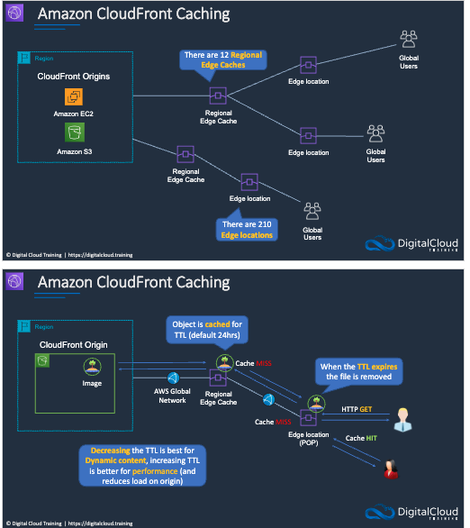
- Example with 2 `origins`
- There are regional edge cached 
    - site between `origin` and `edge locations`
    - 12 of these
- 212 `Edge locations`
    - once a user  connects to the edge location all traffic goes over the AWS global network
- `Cloudfront` can push content to an edge location
    - if there is a cache miss on a user request at the `Edge Location` then it will go to the `Regional Edge Cache`, if there is a miss there then there will be an `origin fetch` to get the file from the origin
    - This will be cached along the way and will expire with the TTL
    - If you have dynamic objects it would be better to have a smaller TTL


- You can define a maximum TTL and default ttl
- Different file types can have different TTL
- Cna use headers to control the cache
- After expiration cloudfront will ensure it has the latest version

- `Path Patterns`
    - ex: any requests for *.jpg should be sent to `origin1`
        - the path pattern determines where toi send the request
    


- Can configure `CloudFront` to forward headers in request to the `origin`
    - Can forward all headers, a whitelist or only default headers
    - `Cloudfront` can then cache multiple versions of an object based on the values in one or more request headers


### CloudFront Signed URLs and OAI/OAC ###

- `Signed Urls` provide more control over access to content, like giving a user a 1 time url for access
    - individual files
    - can specify beginning and expiration 
    - can specify IP addresses
    - should be used for individual files and clients that do not support cookies

- `Signed Cookies` - similar tyo `Signed Urls`
    - use when you don't want to change urls
    - **can provide access ot multiple restricted files**


- `Cloudfront Origin Access Identity`
    - A special type of user/rile that allows the `Cloudfront` distribution to access he custom origin `S3` bucket
    - restricts access to `OAI` only
    - only useful for `S3`
    - **Deprecated**
- `Cloudfront Origin Access`
    - recommended from AWS
    - like an OAI but with more use cases
    - Requires S3 Bucket policy that allows CloudFront service principle
    - restricts content so it can only be accessed by the cloudfront Distribution


### Cloudfront Cache and Behavior Settings ###
[see files here](./aws-saa-code-main/aws-cloudfront)
1. Create 3 `S3` buckets
    - pdf-bucket
    - jpeg-bucket
    - static website
2. Configure `S3` for the static website:
    - Enable public access
    - Configure as a static website
    - Add the index.html (when ready)
    - have to update the bucket policy
```
{
    "Version": "2012-10-17",
    "Statement": [
        {
            "Sid": "Allow access",
            "Effect": "Allow",
            "Principal": "*",
            "Action": "s3:getObject",
            "Resource": "bucket name"
        }
    ]
}
```
3. Configure Amazon CloudFront:
    - Create a new CloudFront distribution
    - Add the static website as an origin (use website endpoint)
    - Disable caching
    - Add 2 more origins for the buckets containing the files and create/configure OAC
    - Configure cache behavior settings for each origin based on file type (PDF or JPG) and default going to the static website

### Cloudfront SSL/TLS and SNI  ###


- To use `AWS Certificates Manager (ACM)` the CloudFront certificate must come from `us-east-1`
    - can bring your own certificate
- Default CF domain name can be changed using `CNAME` DNS record
- You can SSL secure S3 and `Customer Origins`
    - `S3 Origin` already has this configured and cannot be changed
    - `Origin` certs must be public
    - `Custom Origin` (ie: `EC2` or `ALB`)
        - `EC2` - can use 3rd party cert
        - `ALB` - can use `ACM` cert

- When a user issues a request it will be secured with SSl/TLS 
    - known as the `viewer protocol` - the protocol between the viewer and the user
        - ean encore HTTPS or allow HTTP as well, upgrade to HTTPS etc...

- `CloudFront Server Name Indication (SNI)`
    - allows you to have to separate TLS certificates corresponding to different domain names running on the same IP address in `CloudFront`
    - users can connect to different domain names but hit the same `Cloudfront Distributions`
        - knows this from the `host` header


### Lambda Edge ###

- Allows you to run Node.js and Python functions to customize what is returned to the viewer
    - Cane be run at multiple points during the life cycle

### AWS Global Accelerator ###


- Networking service that allows you to utilize AWS Global Network to send data to your applications
    - provides lower latency and more consistency then the regular internet

- 2 Users in the US
- If we have 2 endpoints and are using `Global Accelerator`, `Route 53` will return back 2 static anycast IP addresses that point to `Global Accelerator Endpoint`
    - when you use an alias record in `Route 53` you map the domain name to the domain name of the `Global Accelerator` (or other service) endpoint
        - need to resolve the DNS name of the `Global Accelerator` to its IP
        - either IP will take you any region that is active
            -  you should be directed to the region closest if there are no weights
    - Will eventually be direction ot an `AWS Edge Location` closest to the user
        - use `AWS global network` to connect to the Application Endpoints
            - uses the static anycast IPs
        - only use the public internet for the users to get from their device to the `edge location`
- If one site fails the request will be re-routed to the other endpoint
    - even if a user in the us has to go to `ap-southeast-2` since they are using the `AWS global network` the connection should be a lot faster and more reliable

## Block and File Storage ##
- https://digitalcloud.training/amazon-ebs/
- https://digitalcloud.training/amazon-efs/


### Block vs File vs Object Storage ###

- Block based storage = hard drives and SSD
    - HDD is a magnetic drives and spinning disk
        - Slower and cheaper than SSD
    - SSD - flash memory
        - newer and faster
        - more expensive
    - Create volumes
    - Can paritition the drive to different sizes


- somewhere there is a block based storage system someone made a file system on top of (NTFS)
- Used network attaches storage server (NAS)
    - OS can interact with it just like the other storage
    - Connection is maintained


- user uploads `objects` over HTTP rest API
    - ie: in console or rest api
        - very easy to integrate into applications
    - `S3` supports all file types
    - no defined hierarchy
    - massively scalable


### Amazon EBS Deployment and Volume Types ###

- `EBS volume` is provisioned and attached when launching an `EC2`
    - OS runs from here
- Data is in a single AZ
    - couple replicate to multiple copies but always int he same AZ
- Can connect multi Ec2 instances to an EBS volume using `EBS MultiAttach` as long as `EC2` is in the same `AZ`
    - Only avialable for `Nitro` based instances
    - Must be in same `AZ`
    - Max 16
    - Must be provisioned IOPS
- Can copy a snapshot of the volume to another `AZ`

- GP SSD 
    - GP3 - newer
    - GP2 SSD - default for `EC2`
        - no multi attach
- Provisioned IOPS SSD
    - support multi-attach
    - good for low latency
    - IO2 Block Express - newer 
    - IO2 - deprecated in Nov 2023
    - IO1
        - must fast IOPS
        - only disk type that supports multi attach
    

- HDD - cheaper
    - st1 and sc1
    - limited IOPS compared to ssd
    - save money for warehouse
    - no root capability

- EBS Persist independently of `EC2`
- Do not need to be attached to an instance
- Can attach a multiple volumes to a single instance
- **Must be in same AZ as `EC2`**
- `Root EBS volumes` are delete on `EC2` deletion by default
    - non boot volumes are not delete by default

### Amazon EBS Copying, Sharing and Encryption ###

- `Snapshot` - point in time copy of the data on the volume
    - store in `S3`
        - since this is `regional` we can then create a `EBS Volume` from this in a different `AZ`
    - snapshots are incremental 
    - to free storage space, delete all old snapshots and just keep the latest
    - Can create `Amazon Machine Image (AMI)` from the snapshot 

- `Volume` can create a `snapshot`
- `Snapshot` can create an encrypted `snapshot`

- `Unencrypted Snapshot`
    - Can create encrypted volumes from 
    - cannot create an encrypted `AMI` just unencrypted
- `Encrypted Snapshot` 
    - can create an encrypted `AMI` from an encrypted snapshot
        - cannot share this publicly
        - must have the custom key

- `Encrypted AMI`
    - can create an `EC2` instance and change the encryption key
        - can change encryption state
    - Can create another encrypted `AMI` and change the key
        - change the `region`

- `Unencrypted AMI`
    - Can create `EC2`
        - change encryption station
        - change `AZ`


### Amazon EBS Snapshots and DLM ###

- `Data LifeCycle Manager (DLM)`
    - can automate creating `Snapshots` and `AMI` for us
    - protect data by encoring regular backup schedule
    - creates standardized AMIs that can be refreshed at regular intervals
    - retain backups for compline and auditors
    - reduce storage cost by deleting old backups
    - created disaster recovery backup policies
        - backup data to isolated accounts 


### EC2 Instance Store Volumes ###

- Instance Store Volumes are local disks that are physically attached to host computer
    - extremely high performance
    - **ephemeral storage**
    - ideal for temporary storage that changes frequently
        - buffers, caches, scratch data
    - volume root devices are created from `AMI` templates stored on `S3`
    - Volumes cannot be detached and reattached


### Using RAID with EBS ###

- RAID - redundant array of independent disks
    - a way to take multiple disks and aggregate them together
    - **OS level not provided by AWS, must configure yourself**
    - RAID 0 and RAID 1 are potential options on EBS
    - RAID 5 and RAID 6 are not recommended
- RAID 0 - striping across multiple volumes
    - if any disk fails you lose your data
    - 2 + disks
    - better performance
- RAID 1 - mirroring
    - write the same data to two different volumes
    - redundancy and fault tolerance 
    - used double the amount of capacity 

### Amazon Elastic File System (EFS) ###

- shared file system
- can connect instances from multiple `AZ`
- `Regional` File system
    - have mount targets in multiple `AZs`
    - appear as `ENI`
- Instacnes connect to the mount point in local AZ
- **Linux only**
- Uses NFS
- Can deployed in a single `AZ`  called `One Zone`
    - can connect from other `AZ` in the `Region`

- Data consistency - write operations for `Regional File Systems` are durably stored across AZ
- File Locking - NFS client apps can use NFS v4 file locking for read and write operations
- Storage classes
    - `EFS Standard` - uses SSds for low latency performance
    - `EFS Infrequent Access` - cost effective option
    - `EFS Archive` - even cheaper for less active data

- Durability
    - all storage classes offer 11 9s of durability


- Can be replicated across regions 
    - Must create a mount point
    - the replica file system is read only
- Can connect on prem clients from outside of the cloud
    - must be linux and use NFS
    - typically will used a `Direct Connect`


- EFS replication - data is replicated across `Regions` for disaster recovery purposes
    - Recovery Point Objective (RPO)/Recovery Time Objective (RTO) in minutes
- Automatic backup - integrates with `AWS Backup` for automatic backups
    - `AWS BAckup` is a fully-managed service that makes it easy to centralize and automate data protection across AWS services, in the cloud, and on premises. Using this service, you can configure backup policies and monitor activity for your AWS resources in one place. It allows you to automate and consolidate backup tasks that were previously performed service-by-service, and removes the need to create custom scripts and manual processes. 

- Performance Options
    - `Provisioned Throughput` - specify level of throughput to be supported
    - `Bursting throughput` - scales with the amount of storage

- `AWS DataSync` - fast and simple way to securely sync existing files systems into `EFS`
    - Securely and efficiently copy files over internet or direct connect
    - copies file data and metadata 

### Amazon FSx ###

- Fully managed third party file systems
    - `FSX` for windows file server
    - `FSX` for `lustre`
        - compute intensive


- fully managed native windows file system
    - full support for many window protocols
- can be accessed by 1000s of instances
- High Availability - replicates data withing the `AZ`
- Multi AZ - create an active stand by file server in separate `AZ`
- Can have a managed microsoft `AZ` for auth
- Can access from an on premises client with a `VPN` or `Direct Connect Connection`


- High performance workloads
    - machine learning
    - HPC
    - Video Processing
    - Financial modeling
    - Electronic design automation
- Works natively with `S3`
- `S3` objects are presented as files in your file system
    - can write results to `S3`
- Posix compliant file system
- Use for cloud bursting and data migration
- Can access from an on premises client with a `VPN` or `Direct Connect Connection`


### AWS Storage Gateway ###

- Allows you to connect on prem storage to AWS
- Deploy gateways into your on prem data centers
    - Allows to connect to storage on AWS
    - Encrypted in transit


- Mounted with NFS or SMB in local data center
- local cache provides low latency
- virtual gateway appliance runs on some vm
- store files as objects in `S3`
    - multiple storage classes
    - application can talk in file system protocols while talking to `S3`


- ISCSI - block based only
- Cached Volume Mode - cache of most recently used data is stored on prem
- Stored Volume Mode - entire data set is stored on prem
    - backed up to `S3`
    - Snapshots are taken for backup


- Backup servers is on premises
- Connect to a virtual Tape Library
- Store in `S3`
    - once tapes are ejected from the backup app they can be stored in other storage classes like glacier and deep archive
- Used with popular backup software
    - NetBackup, Backup Exec, Veeam
- various sizes up to 2.5 TB
- Can have up to 1500 virtual tapes
    - max capacity of 1 PB
- All data is transferred between he gateway and AWS is encrypted with SSL
- All data stored in encrypted Server Side with `SSE-S3`
    - encryption keys managed by AWS


## Docker Containers and ECS ##

### Docker Containers and MicroServices ###


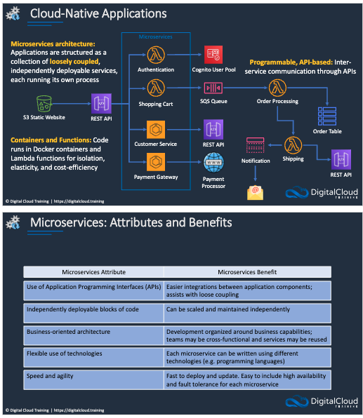

### Amazon Elastic Container Services (ECS) ###


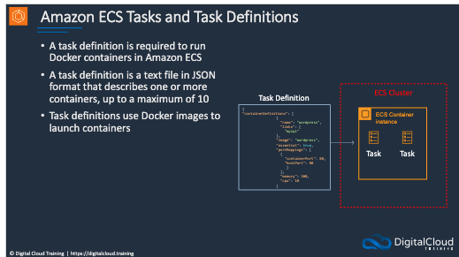


### Amazon ECS IAM Roles ###


### Scaling Amazon ECS ###


### Amazon ECS With ALB ###


### Launch Docker Containers on AWS Fargate ###

### Amazon Elastic Kubernetes Service (EKS) ###


### Amazon Elastic Container Registry (ECR) ###

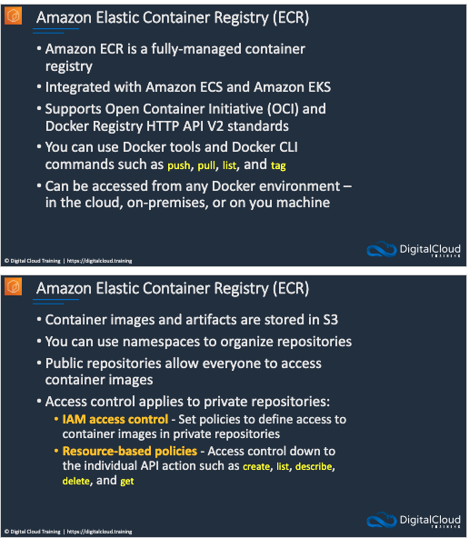


### AWS App Runner ###


## Serverless Applications ##

### Serverless Services and Event Driven Architecture ###


### AWS Lambda ###


### Application Integration Services Overview ###


### Amazon SQS ###


### Amazon SNS


### Simple Event Driven APP ###


### AWS Step Functions


### Create a State Machine ###


### Amazon EventBridge ###


### Create Event Bus and Rule


### Amazon API Gateway ###


## Database and Analytics ##

### Database Types and Use Cases ###


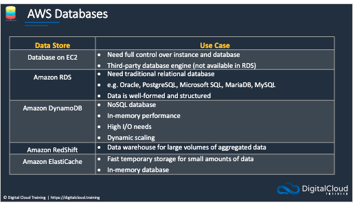

### Amazon Relational Database Service (RDS) ###


### Amazon RDS Backup and Recovery ###


### Create Amazon RDS Database ###

### Create a Read Replica ###

### Amazon RDS Security ###


### Create Encrypted Copy Of RDS Database ###


### Amazon Aurora ###


### Amazon Aurora Deployment Operations ###


### Amazon RDS Proxy ###


### Amazon Elasticache ###


### Scaling Elasticache ###


### Create Elasticache Cluster ###

### Amazon DynamoDB  ###


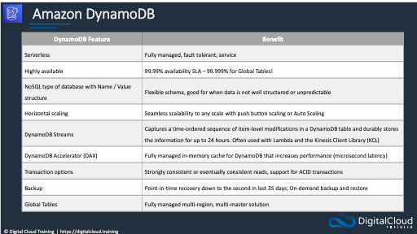

### Creating A DynamoDB Table ###

### DynamoDB Streams ###


### DynamoDB Accelerator ###

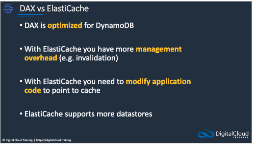

### DynamoDB Global Tables ###


### Enable Global Table ###

### Amazon RedShift ###


### Amazon Elastic Map Reduce ###


### Amazon Kinesis ###


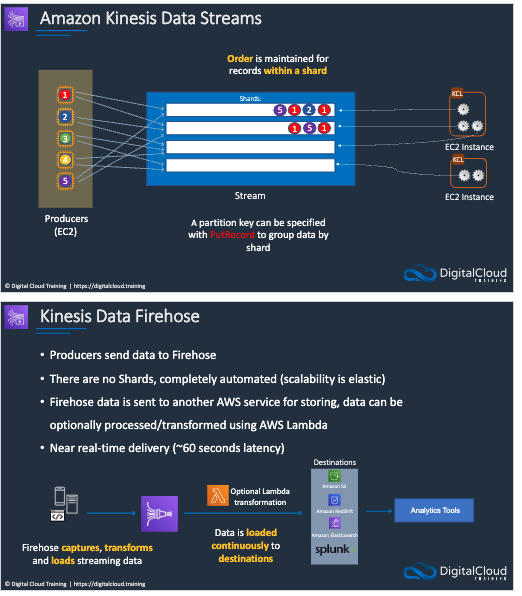


### Amazon Athena and AWS Glue ### 
- https://aws.amazon.com/blogs/big-data/top-10-performance-tuning-tips-for-amazon-athena/


### Query S3 ALB Access Logs with Athena ### 


### Amazon OpenSearch Service (ElastiSearch)


### AWS Batch


### Other Database Services 
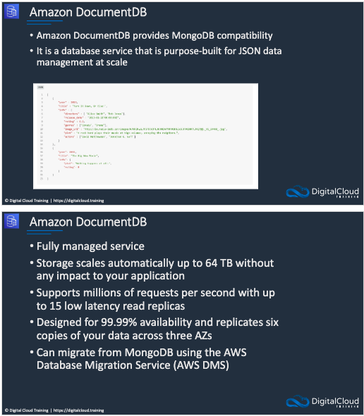


### Other Analytics Services ###


## Deployment And Management ##

### Infrastructure as Code With AWS CloudFormation ###


### Creating and Updating Stacks 


### Create Nested Stack using AWS CLI 


### Platform as a Service with AWS Elastic Beanstalk


### Create an Elastic Beanstalk Service

### SSM Parameter Store


### AWS Config


### SSM Automation and Config Rules 

### AWS Secrets Manager
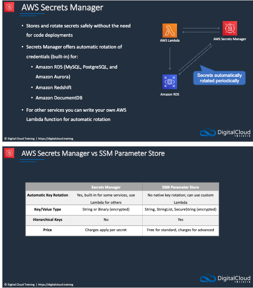

### Ops Works


### AWS Resource Manager 
- https://docs.aws.amazon.com/ram/latest/userguide/shareable.html
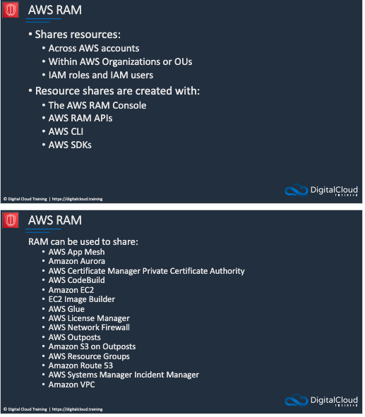

### Share a Subnet Across Accounts

### RPO, RTO, DR Strategies
- https://aws.amazon.com/blogs/architecture/disaster-recovery-dr-architecture-on-aws-part-i-strategies-for-recovery-in-the-cloud/


## Monitoring, Auditing and Logging 
- https://digitalcloud.training/amazon-cloudwatch/
- https://digitalcloud.training/aws-cloudtrail/

### Amazon CloudWatch Overview

- `CloudWatch` is a performance monitoring tool, can trigger alarms, log collection and automated actions
    - Use Cases:
        - Collect performance metrics from AWS and on prem systems
        - Automate responses to operational changes
        - Improve operational performance and resource optimization
        - Derive actionable insights from logs
        - Get operational visibility and insight
    - Core Features
        - `CloudWatch Metrics`
            - services send time-ordered data points 
            - Metrics sent every 5 mins by default for `Ec2`
                - sends every 1 min with `Detailed EC2 Monitoring`
                - `CloudWatch detailed` monitoring is enabled by default when creating launch configurations through the CLI.
            - unified `CloudWatch Agent` sends system level metrics for `EC2` and on prem servers
                - **include memory and disk usage (need the agent)**
                - collects log files and metrics together
            - can publish custom metrics from CLI or API
                - 2 Resolutions
                    - Standard : data to the minute
                        - default resolution
                    - High : data to 1 second
        - `CloudWatch Alarms` 
            - monitor metics and initiate actions
            - example: auto scaling group responding to amount of load
            - Types
                - `Metric` - performs one or more actions based on the alarm
                - `Composite` - uses a rule expression and takes into account multiple alarms
            - States
                - OK
                - ALARM - outside threshold
                - INSUFFICIENT_DATA - does not know enough
        - `CloudWatch Logs`
            - centralized collection of system application logs
        - `CloudWatch Events`
            - stream of system event describing changes to AWS resources
                - can trigger actions 
    


### Create A custom Metric and Alarm 
- see [steps here](./aws-saa-code-main/amazon-cloudwatch/custom-cloudwatch-metrics.md)


### Amazon Cloudwatch Logs

- gather application and system logs in `CloudWatch`
- Defined expiration policies and `KMS` encryption
- Send to: 
    - `S3`
    - `Kineses Data Streams`
    - `Kineses Data FireHose`
- `Unified Cloudwatch Agent` is what is actually used to send data 
    - Need permissions to actually allow sending data to `CloudWatch`
- Can export information to destinations like `ElasticSearch`

### The unified CloudWatch Agent
- https://docs.aws.amazon.com/AmazonCloudWatch/latest/monitoring/metrics-collected-by-CloudWatch-agent.html


- Collect internal System Level metics from `EC2` instances across OS
    - Also on prem
- Can retrieve custom metrics
    - must use `StatsD` or `collectd` protocol
- Collect logs from `EC2` instances or  on prem (Windows/Linux)
- **Agent must be installed on the server**
    - logs files are sent in real time so wont lose the metrics when instance is terminated
    - Can be installed on:
        - `EC2`
        - On Prem
        - Linux, Windows Server or MacOS
            - Collects a ton of metrics for Linux and MacOS that is not in standard metrics
                - Disk data, memory data, 
            - Data from Windows Performance Monitor
    


### AWS CloudTrail


- logs API Activity for auditing
    - ie: when user or automated tasks take action
- Retained for 90 days by default
- `CloudTrail Trail` logs any events to `S3` for indefinite retention
    - Can send notification via `SNS` when a log file irs published
    - Can enabled log file integrity validation
        - ensures logs have not been modified

- `Trail` can be within 1 `Region` or all `Regions`
- `CloudWatch Events` can be triggered based on API calls to `CloudTrail`
- Events can be streamed to `CloudWatch` Logs


- Event Types:
    - Management Events - provide information about manage operations that are performed on resources in your AWS Account
        - Launch an `EC2`, create  a DB or `Lambda` etc...
        - Stores who, when, what 
    - Data Events - provide information about resource operations performed on or in a resource
        - provides more detail
    - Insight Events - identify and respond to unusual activity associated with write API calls continuous analyzing `CloudTrail` management


### Create A Trail In AWS CloudTrail


### AWS EventBridge (Refresher)

- Used to be know as `CloudWatch Events`
- Has been separated out into separate console
- Data is sent from events in the sources to the `EventBridge Event Bus`
    - Then rules determine what to do with the data being received
    - decide which `target` receives the info

### Create EventBridge Rule for CloudTrail API Calls

### Metrics and Analysis Tracking 

- Use X_Ray to visualize components of your application, identify performance bottlenecks and troubleshoot request that resulted in an error
- Service send trace data and `X-Ray` processes the data to generate service mpa and searchable trace summaries

- `AWS X-Ray` - used with applications running on `EC2` `ECS`, `Lambda` and `Elastic Beanstalk` 
    - must integrate with `X-Ray SDK` with your application and install the `X-Ray Agent`
        - Agent is a software application that gathers raw segment data and relays it to the `X-Ray` Service
        - SDK captures metadata for request made to MySQL, Postgres and `DynamoDB`, as well as `SQS` and `SNS`


- `AWS Managed Prometheus` - 
    - Prometheus is an open-source monitoring system and time series database
    - Uses PromQL to monitor and alert the performance of containerized workloads
    - Scales the ingestion, storage, alerting and querying of operational metrics as workloads grow or shrink
    - Integrated with `EKS`, `ECS` and `AWS Distro for OpenTelemetry`

- Open source analytics monitoring solution for databases
- Highly scalable, available and aws managed
- Provides interactive data visualization for your monitoring and operation data
- Visualize analyze and alarm on your metrics. logs and traces collection from multiple data sources
- Integrates with `AWS SSO and SAML`
- Can visualize the data from `X-Ray`


## Security In the Cloud 

### AWS Directory Service


### Identity Providers and Federation 


### IAM Identity Center in Action

### Amazon Cognito


### Encryption Primer 


### AWS Key Management Service (KMS)
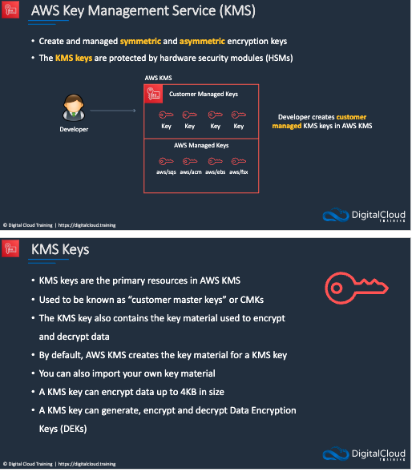

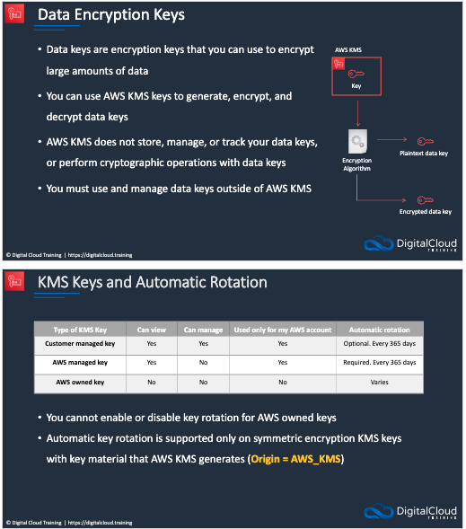


### AWS CloudHSM 


### AWS Certificate Manager 


### SSL/TLS Certificate ACM

### AWS Web Application Firewall


### Amazon inspector 


### Amazon Macie 


### AWS Guard Duty


### AWS Shield


### Defense In Depth 


## Migration and Transfer 
- Many tools available to migrate into and out of AWS 
- https://digitalcloud.training/aws-migration-services/

### AWS Migration Tool Overview
### AWS Application Discovery Service 

- Could be migrating into AWS from a corporate/on prem data center
    - have dbs, servers, NAS
- Connected with `Direct Connect`, `VPn` or the Internet
- `Application Discovery Service`    
    - collects data about on prem resources
- `AWS Application Migration Service` - can migrate servers into `EC2`
- `AWS Database Migration Service` - Migrates DBs into `RDS`
- `AWS DataSync` - migrates into `EFS`
- `AWS Migration Hub` - monitors migration that use AWS Services or Partner Tools


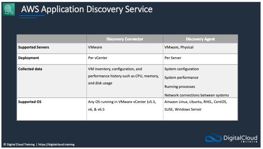
- `Application Discovery Service (ADS)` 
    - can collect metadata such as hostnames, ip addresses, macs 
    - also resources including CPU, network, memory etc...
    - can use agent based discover for windows and linux OS
    - can be saved to `S3` and queried with `Athena` or `QuickSite`
- `Discovery Connector` - per center
    - VmWare allows an agentless discovery
    - Static Configs
    - VM utilization metrics
- `Discover Agent` - per server
    - other OS and agents not using VMWare
    - data forwarded to `ADS`
        - Static Configs
        - Time Series Performance
        - Network I/O
        - Running process
    


### Database Migration Service (DMS)


- USed for migrating databases
    - Can use `Schema Conversion Tool` for heterogenous migrations
        - Heterogenous = going from 1 db type to another
        - Homogenous = going from same db type to same db type
- Use Cases:
    - cloud to cloud
    - on prem to cloud
    - Development and Test 
    - Database Consolidation - consolidate multiple db into a single db
    - Continuous Data Replication - use fro single source multi-target or multi-source single target

### AWS Application Migration Service (MGN)


- Used for migrating servers
    - The agent-based replication is recommended where possible
        - supports continuous data protection
    - Can provide and agentless snapshot based replication with `AWS MGN vCenter Client` 
        - not recommended
    - Provides automated incremental and schedule migrations
    - can automate actions in conjunction with `Lambda`
    - `EC2 Instances` are launched from launch templates
- Used for **lift and shift** rehost of applications to AWS
    - continuos block level replication
        - cut over windows in minutes
    - Old Service was the `Server Migration Service (SMS)` which used cut over windows in hours
- Entire application group cna be migrated in a `migration wave`
    - could also use `CloudFormation`
- Can migrate both virtual and Physical Servers

### AWS DataSync


- Used for mirgating data
    - Can be shared file system or Object Bases Storage
- `DataSync` has a software agent that connects to the software system
    - can migrate to `S3` `FSX` or `EFS`
        - Supports multiple `FSX` services
    - Can transfer data between NFS, SMB, Hadoop, Sle manage object Storage, `Snowcone`, `S3` EFS and FSX
    - all data is encrypted in transit
    - supports schedule and automated transfers
- `AWS Snowcone` - a DataSync Agent is installed on the snowcone
    - Can transfer this data to AWS Services
- `Amazon S3 On Outpost` allows this awa well


### AWS Snowball Family 


- Physical, tamper resistant, encrypted devices
    - 256 bit encryption
        - manage with `AWS KMS` in tamper resistant `Trusted Platform Modules (TPM)`
- Client software is installed on your computer
- `Snowball` and `SnowMobile` are used for migrating large volumes of data to AWS
    - 10s - 100s of terabytes, data needs to be transferred quickly but do not have alot of bandwidth
    - Snowball 
        - 80TB or 50TB - petabyte scale
    - SnowMobile - 100 PB per snowmobile
        - exabyte scale
- `SnowBall Edge Compute Optimized`
    - provides object storage and option GPU
    - used for data collection, ML and processing, storage at the edge (factory, remote area etc...)
- `SnowBall Edge Storage Optimized`
    - provides block storage and `S3` compatible storage
    - Uses for local storage and large scale data transfer
- `Snowcone`
    - Small device used for ege computing, storage and data transfer
    - Can transfer data offline or online with `DataSync Agent`

- Optimization of data transfer
    1. Uses latest `snowball` client
    2. Batch Small files together
    3. Perform multiple copy operations at one time
    4. Copy from multiple work stations
    5. Transfer directions not files

- Use Cases
    - Cloud Data migration
    - Content Distribution
    - Tactical Edge Computing
    - machine Learning on device
    - Manufacturing - data collection and analysis in the factory
    - Remote locations with simple data 
        - pre-processing, tagging compression etc..


### The 7Rs of Migration 


- Refactor - completely re-architect the application to a cloud-native serverless architecture 
    - use cloud native architecture such as serverless functions or containers
    - migrate databases to managed or severless NoSqlDB
    - could be a decent amount of work
- Replatform
    - Move MySQl db to `RDS` and linux server to `Elastic BeanStalk`
        - may need some code update, db update etc...
        - can use `Database Migration Service` and `Schema Migration Tool`
- Repurchase - uses a different solution
- Rehost
    - what AWS terms as lift and shift 
        - move application from your host an `Ec2` host etc.. with `AWS Application Migration Service`
            - need `AWS Replication Agent` installed on servers if not VMWare
    - At some point we perform the final sync and cut over the instance
- Relocate
    - lift and shift the server
    - no os or application changes
- Retain - do nothing for now
- Retire - done with application, get rid of it


## Web, Mobile, ML, Cost Management

### AWS Amplify and AppSync


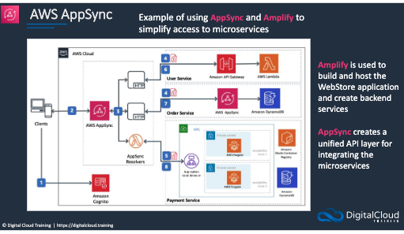

### AWS Device Farm

### AWS Machine Learning and AI Services


### Process and Analyze Videos


### AWS License Manager


### AWS Compute Optimizer


### AWS Budgets

### AWS Cost Explorer

### Cost Allocation Tags


### AWS Cost Management Tools


